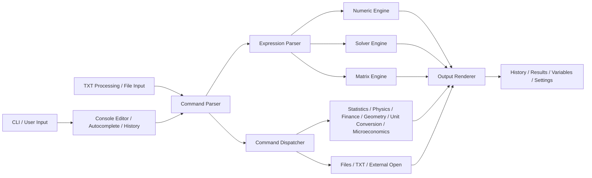
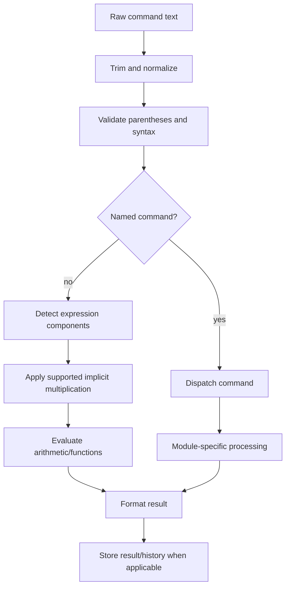
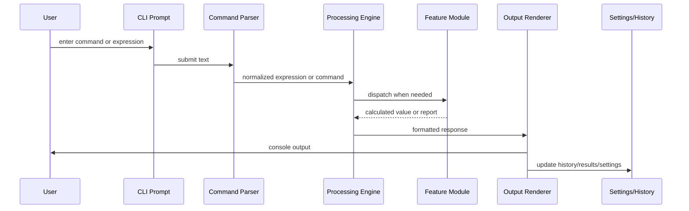
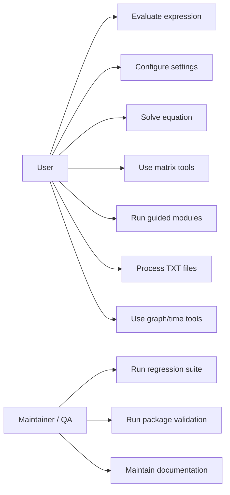
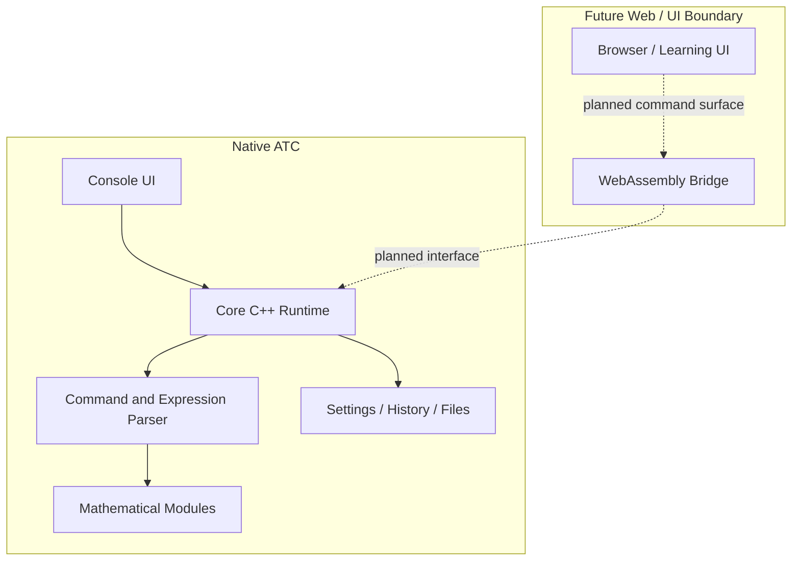

# Advanced Trigonometry Calculator Software Requirements Specification

Version: ATC 2.1.7 in development  
Author: Renato Alexandre dos Santos Freitas  
License: GPL-3.0  
Standard alignment: IEEE 29148-style Software Requirements Specification  
Document status: Maintained project requirements baseline

## 1. Introduction

### 1.1 Purpose

This Software Requirements Specification (SRS) defines the functional
requirements, non-functional requirements, quality attributes, constraints,
traceability and acceptance criteria for Advanced Trigonometry Calculator
(ATC). It is the formal requirements baseline used for development,
maintenance, testing, packaging and future planning.

### 1.2 Scope

ATC is a free, open-source Windows command-line mathematical application. It
evaluates text-based mathematical expressions and documented ATC commands in a
console environment.

ATC focuses on practical command-driven numerical computation, educational
workflows, implemented symbolic/numeric hybrid features, local execution and
Windows console compatibility. It is not a full general-purpose computer
algebra system.

### 1.3 Target Audience

- Project author and maintainer.
- Contributors implementing or reviewing changes.
- QA engineers designing automated and manual validation.
- Documentation maintainers.
- Users requiring a precise behavioral reference.

### 1.4 Definitions and Glossary

| Term | Formal definition |
| --- | --- |
| ATC | Advanced Trigonometry Calculator, a C++ Windows command-line mathematical application. |
| CLI | Command-line interface used to enter expressions, commands and guided-module choices. |
| Parser | The ATC subsystem that tokenizes, normalizes, validates and routes textual mathematical input before evaluation. |
| Expression Parser | Parser path dedicated to arithmetic, functions, constants, variables, matrices and implicit multiplication. |
| Solver | A computational subsystem that searches for values satisfying an equation or expression constraint, such as `solver(...)`, `solve equation(...)` or equation-system solving. |
| Numeric Engine | The typed runtime evaluation path that computes scalar, complex and precision-dependent numerical values. |
| Polynomial Engine | The polynomial processing subsystem used by simplification, roots-to-polynomial, textual polynomial normalization and supported equation-solving fast paths. |
| Result Reference | A session-level result identifier such as `#0`, used to reuse previous outputs in later expressions where supported. |
| Precision Mode | Runtime numeric mode selected between `double` and Boost `mp_float`, persisted through ATC settings and applied at startup. |
| Command Bridge | ATC workflows that accept commands through redirected input, TXT files, command-line interaction or external command handoff. |
| TXT Detector | The file-based workflow that detects or waits for TXT content/flags, processes commands and writes answer files. |
| Dynamic Arrays | Heap-allocated arrays managed by ATC allocation helpers, including initialization, size tracking, clearing and release. |
| Guided Modules | Interactive command groups, such as finance, geometry, physics, unit conversions and microeconomics, that present menu-driven calculations. |
| Verbose Resolution | Diagnostic output mode that explains selected intermediate processing steps, parser stages and calculation routing. |
| External-open Action | A command that opens Notepad, Explorer, a browser, another ATC process, a download target or an OS shell action. |
| Memory Factor | Ratio `PeakWorkingSetDuringOperation / BaselineWorkingSetAfterStartup`. It is used to express bounded memory growth in repeatable tests. |
| CAS | Computer algebra system. ATC is not a full general-purpose CAS. |

### 1.5 Acronyms

| Acronym | Meaning |
| --- | --- |
| ATC | Advanced Trigonometry Calculator |
| CLI | Command-Line Interface |
| SRS | Software Requirements Specification |
| FR | Functional Requirement |
| NFR | Non-Functional Requirement |
| FRF | Future Requirement |
| DSP | Digital Signal Processing |
| TXT | Plain text file |
| OS | Operating System |
| PDF | Portable Document Format |
| DOCX | Microsoft Word Open XML document |
| Wasm | WebAssembly |

### 1.6 References

- `README.md`
- `docs/Architecture.md`
- `docs/Developer_Guide.md`
- `docs/Developer_Reference.md`
- `docs/Testing.md`
- `docs/User_Guide.md`
- `docs/en/User_Guide_Full.md`
- `docs/ATC_2.1.7_DOCUMENTATION.md`
- `docs/RELEASE_2.1.7.md`
- `CHANGELOG.md`
- `tests/ATC_AUTOMATED_TEST_CASES.md`
- `tests/ATC_USER_GUIDE_COVERAGE.md`
- `tests/run-atc-regression.ps1`
- `tests/run-atc-isolated-coverage.ps1`
- `tests/run-atc-memory-stress.ps1`
- `tests/run-atc-package-validation.ps1`

## 2. Product Overview

ATC starts a typed runtime, accepts user input or command-bridge input,
normalizes and validates the command, dispatches it to the appropriate
mathematical or workflow module, renders output, stores results when
applicable and persists settings/history where documented.

ATC 2.1.7 emphasizes persistent precision mode, solver/polynomial fixes,
automatic multiplication improvements, variable-name improvements,
autocomplete, history navigation, Windows console stability, memory cleanup
and expanded automated regression coverage.

## 3. System Objectives

| ID | Objective |
| --- | --- |
| OBJ-001 | Provide a local command-line mathematical tool with deterministic behavior for documented commands. |
| OBJ-002 | Support arithmetic, trigonometry, logarithms, complex numbers, matrices, statistics, DSP, equations, polynomial tools and guided modules where implemented. |
| OBJ-003 | Preserve Release x64 and Release x86 build validation. |
| OBJ-004 | Keep user-visible output stable enough for automated regression testing. |
| OBJ-005 | Persist settings, variables, results, history and precision mode where documented. |
| OBJ-006 | Maintain bounded dynamic-memory behavior using allocation helpers and memory stress validation. |
| OBJ-007 | Keep documentation, tests and release packaging synchronized. |
| OBJ-008 | Avoid unsupported claims of full general-purpose symbolic algebra. |

## 4. Requirements Conventions

Priority levels use this SRS-specific scale:

- **Critical:** required for core calculation, safe execution, release
  acceptance or legal/project identity.
- **High:** required for complete documented workflows and normal user
  productivity.
- **Medium:** useful documented behavior, partial automation target or
  secondary workflow.
- **Low:** deferred, optional or explicitly outside the current release scope.

Requirement status values are:

- **Implemented:** available and covered by automated, isolated or documented
  validation.
- **Partial:** available but not exhaustively covered or still has known manual
  validation gaps.
- **Experimental:** present but intentionally treated as unstable or limited.
- **Planned:** not part of the current implemented release baseline.
- **Deprecated:** retained only for compatibility and not recommended for new
  workflows.

Verification methods are:

- **Automated Test:** validated by regression, isolated, SRS gate, memory or
  package runners.
- **Manual Test:** requires physical interaction, external windows or unsafe OS
  actions.
- **Inspection:** validated by source/document/package review.
- **Analysis:** validated by reasoning over constraints, design assumptions or
  measured telemetry.

Lifecycle fields use the best available project history. When exact version
history is not externally verifiable, this SRS uses:

- `Introduced: pre-2.1.7` for existing ATC behavior;
- `Modified: 2.1.7` for features actively corrected, covered or documented in
  the current release work.

## 5. Architectural Assumptions

These assumptions define the operating context for the requirements. Detailed
architecture remains documented in `docs/Architecture.md`.

| ID | Assumption |
| --- | --- |
| AA-001 | ATC is executed locally on the user's Windows environment. |
| AA-002 | The command-line interface is the primary user interface for ATC 2.1.7. |
| AA-003 | Deterministic commands should produce stable output for the same settings, inputs and precision mode. |
| AA-004 | Core mathematical workflows must operate offline. |
| AA-005 | ATC does not require a cloud service for normal calculation workflows. |
| AA-006 | External-open actions are side effects of explicit user commands, not hidden runtime dependencies. |
| AA-007 | Release validation is performed through x64/x86 builds, automated regression tests and documented manual gaps. |

## 6. System Constraints

### 6.1 Technical Constraints

- ATC 2.1.7 is a native C++ console application.
- Public behavior is command-driven and text-based.
- Persistent settings are stored in local files under the ATC user data folder.
- High precision depends on the implemented Boost `mp_float` paths.
- Automated tests must avoid destructive OS actions and uncontrolled external
  windows.

### 6.2 Windows and Console Constraints

- Windows console behavior differs between legacy `cmd.exe`, Windows Terminal
  and newer Windows 11 defaults.
- Some visual behavior requires manual validation because console rendering is
  environment-dependent.
- x86 remains relevant for compatibility with older Windows environments.

### 6.3 Build and Compiler Constraints

- The project is built from `Advanced Trigonometry Calculator.sln`.
- Build instructions may vary with the installed Visual Studio/MSBuild and
  Windows SDK versions.
- Release x64 and Release x86 are the documented validation targets.

### 6.4 External Dependencies

- ATC does not require Internet access for core calculations.
- Documentation/package generation may use local Python tooling.
- Update, donation and website commands may reference external URLs only when
  explicitly invoked by the user.

## 7. Negative Requirements (Out of Scope)

ATC 2.1.7 shall not be required to:

- require Internet access for normal mathematical computation;
- send telemetry or hidden usage data;
- depend on cloud services for core execution;
- modify arbitrary files outside documented ATC workflows and user-selected
  paths;
- execute PC-control commands without explicit user action;
- act as a universal symbolic CAS equivalent to Mathematica, Maple, SageMath or
  SymPy;
- prove arbitrary mathematical theorems;
- replace domain-specific professional engineering validation tools;
- provide a complete WebAssembly or browser UI in the native 2.1.7 release.

## 8. Requirement Attribute Register

The following register is the authoritative audit layer for requirement
attributes. Requirement text below defines the expected behavior; this register
adds implementation state, risk, complexity, affected modules and verification
method.

| Requirement ID | Priority | Status | Risk | Complexity | Dependencies | Impacted modules | Verification method |
| --- | --- | --- | --- | --- | --- | --- | --- |
| FR-001 | Critical | Implemented | Low | Low | None | CLI, command editor, environment commands | Automated Test |
| FR-002 | Critical | Implemented | Low | Low | FR-001 | CLI, command editor, environment commands | Automated Test |
| FR-003 | High | Implemented | Low | Medium | FR-001 | CLI, command editor, environment commands | Automated Test |
| FR-004 | High | Implemented | Low | Medium | FR-001 | CLI, command editor, environment commands | Automated Test |
| FR-005 | High | Implemented | Low | Low | FR-001 | CLI, command editor, environment commands | Automated Test |
| FR-006 | Medium | Partial | High | Low | FR-001 | CLI, command editor, environment commands | Manual Test |
| FR-007 | Critical | Implemented | Low | High | FR-001 | Command parser, expression parser, variables and results | Automated Test |
| FR-008 | Critical | Implemented | Low | Low | FR-007 | Command parser, expression parser, variables and results | Automated Test |
| FR-009 | High | Implemented | Low | Low | FR-007 | Command parser, expression parser, variables and results | Automated Test |
| FR-010 | High | Implemented | High | High | FR-007, FR-008, FR-009 | Command parser, expression parser, variables and results | Automated Test |
| FR-011 | High | Implemented | Low | Medium | FR-007 | Command parser, expression parser, variables and results | Automated Test |
| FR-012 | High | Implemented | Low | Medium | FR-001, FR-007 | Command parser, expression parser, variables and results | Automated Test |
| FR-013 | High | Implemented | Low | Low | FR-007, FR-011 | Command parser, expression parser, variables and results | Automated Test |
| FR-014 | Critical | Implemented | Low | Low | FR-007, FR-009 | Numeric engine, arithmetic engine, precision mode | Automated Test |
| FR-015 | High | Implemented | Low | Low | FR-007, FR-014 | Numeric engine, arithmetic engine, precision mode | Automated Test |
| FR-016 | Critical | Implemented | Low | High | FR-007, FR-011, FR-014 | Numeric engine, arithmetic engine, precision mode | Automated Test |
| FR-017 | Critical | Implemented | Low | Medium | FR-007, FR-056 | Numeric engine, arithmetic engine, precision mode | Automated Test |
| FR-018 | Critical | Implemented | Low | Medium | FR-055 | Trigonometry, hyperbolic and logarithmic functions | Automated Test |
| FR-019 | High | Implemented | Low | Medium | FR-007, FR-018 | Trigonometry, hyperbolic and logarithmic functions | Automated Test |
| FR-020 | High | Implemented | Low | Medium | FR-007, FR-016 | Trigonometry, hyperbolic and logarithmic functions | Automated Test |
| FR-021 | High | Implemented | Low | Medium | FR-007, FR-016 | Trigonometry, hyperbolic and logarithmic functions | Automated Test |
| FR-022 | Critical | Implemented | High | High | FR-007, FR-010, FR-016 | Polynomial engine, equation solver, numerical solver, function study | Automated Test |
| FR-023 | High | Implemented | Low | Medium | FR-016, FR-022 | Polynomial engine, equation solver, numerical solver, function study | Automated Test |
| FR-024 | Critical | Implemented | High | High | FR-007, FR-010, FR-016, FR-022 | Polynomial engine, equation solver, numerical solver, function study | Automated Test |
| FR-025 | High | Implemented | Low | Medium | FR-016, FR-024 | Polynomial engine, equation solver, numerical solver, function study | Automated Test |
| FR-026 | Critical | Implemented | Low | Medium | FR-007, FR-014 | Polynomial engine, equation solver, numerical solver, function study | Automated Test |
| FR-027 | Critical | Implemented | High | High | FR-007, FR-018, FR-019, FR-020, FR-021 | Polynomial engine, equation solver, numerical solver, function study | Automated Test |
| FR-028 | High | Implemented | Low | High | FR-007, FR-019, FR-022, FR-024 | Polynomial engine, equation solver, numerical solver, function study | Automated Test |
| FR-029 | High | Implemented | Low | Medium | FR-007, FR-013 | Matrix engine, lists and sorting | Automated Test |
| FR-030 | High | Implemented | High | High | FR-029 | Matrix engine, lists and sorting | Automated Test |
| FR-031 | High | Implemented | Low | Medium | FR-029 | Matrix engine, lists and sorting | Automated Test |
| FR-032 | High | Implemented | Low | Medium | FR-007, FR-029 | Matrix engine, lists and sorting | Automated Test |
| FR-033 | Medium | Implemented | Low | Low | FR-007 | Matrix engine, lists and sorting | Automated Test |
| FR-034 | High | Implemented | Low | Medium | FR-014 | Statistics, DSP and guided domain modules | Automated Test |
| FR-035 | High | Implemented | Low | Medium | FR-001, FR-014 | Statistics, DSP and guided domain modules | Automated Test |
| FR-036 | High | Implemented | Low | Medium | FR-007, FR-014 | Statistics, DSP and guided domain modules | Automated Test |
| FR-037 | High | Implemented | Low | Medium | FR-001, FR-014 | Statistics, DSP and guided domain modules | Automated Test |
| FR-038 | High | Implemented | Low | Medium | FR-001, FR-014 | Statistics, DSP and guided domain modules | Automated Test |
| FR-039 | High | Implemented | Low | Medium | FR-001, FR-014 | Statistics, DSP and guided domain modules | Automated Test |
| FR-040 | High | Implemented | Low | Medium | FR-001, FR-014 | Statistics, DSP and guided domain modules | Automated Test |
| FR-041 | High | Partial | Low | Medium | FR-001, FR-014 | Statistics, DSP and guided domain modules | Automated Test |
| FR-042 | High | Implemented | Low | Medium | FR-001, FR-014 | Statistics, DSP and guided domain modules | Automated Test |
| FR-043 | High | Implemented | Low | High | FR-029, FR-030 | Statistics, DSP and guided domain modules | Automated Test |
| FR-044 | High | Implemented | Low | Medium | FR-055 | Graph, time and calendar modules | Automated Test |
| FR-045 | Medium | Partial | Low | High | FR-007, FR-044 | Graph, time and calendar modules | Manual Test |
| FR-046 | Medium | Implemented | Low | Medium | FR-001 | Graph, time and calendar modules | Automated Test |
| FR-047 | Medium | Partial | Low | Medium | FR-001 | Graph, time and calendar modules | Manual Test |
| FR-048 | High | Implemented | Low | Medium | FR-001 | TXT processing, files and command bridge | Automated Test |
| FR-049 | Critical | Implemented | High | High | FR-002, FR-048 | TXT processing, files and command bridge | Automated Test |
| FR-050 | Critical | Implemented | High | High | FR-048, FR-049 | TXT processing, files and command bridge | Automated Test |
| FR-051 | High | Partial | Low | Medium | FR-048 | TXT processing, files and command bridge | Automated Test |
| FR-052 | High | Implemented | Low | Medium | FR-002 | TXT processing, files and command bridge | Automated Test |
| FR-053 | High | Implemented | Low | Medium | FR-055 | TXT processing, files and command bridge | Automated Test |
| FR-054 | High | Partial | Low | Medium | FR-001 | TXT processing, files and command bridge | Automated Test |
| FR-055 | Critical | Implemented | Low | Medium | FR-001 | Settings, persistence, memory and error handling | Automated Test |
| FR-056 | Critical | Implemented | High | High | FR-055 | Settings, persistence, memory and error handling | Automated Test |
| FR-057 | High | Implemented | Low | Medium | FR-013, FR-055 | Settings, persistence, memory and error handling | Automated Test |
| FR-058 | High | Implemented | Low | Medium | FR-004, FR-055 | Settings, persistence, memory and error handling | Automated Test |
| FR-059 | Critical | Implemented | High | High | None | Settings, persistence, memory and error handling | Automated Test |
| FR-060 | Critical | Implemented | High | Low | FR-001, FR-007 | Settings, persistence, memory and error handling | Automated Test |
| NFR-001 | Critical | Implemented | Medium | Low | FR-001, FR-055, FR-056 | Cross-cutting quality attributes | Automated Test |
| NFR-002 | Critical | Implemented | Medium | Low | FR-014 | Cross-cutting quality attributes | Automated Test |
| NFR-003 | High | Implemented | Medium | High | FR-022, FR-024, FR-030 | Cross-cutting quality attributes | Automated Test |
| NFR-004 | Critical | Implemented | High | High | FR-059 | Cross-cutting quality attributes | Automated Test |
| NFR-005 | Critical | Implemented | Medium | Low | FR-017, FR-056 | Cross-cutting quality attributes | Automated Test |
| NFR-006 | Critical | Implemented | Medium | Low | FR-001 | Cross-cutting quality attributes | Automated Test |
| NFR-007 | Critical | Implemented | Medium | Low | FR-060 | Cross-cutting quality attributes | Automated Test |
| NFR-008 | Critical | Implemented | Medium | High | FR-001 | Cross-cutting quality attributes | Automated Test |
| NFR-009 | High | Partial | Medium | High | FR-001, FR-005 | Cross-cutting quality attributes | Manual Test |
| NFR-010 | High | Implemented | Medium | Low | None | Cross-cutting quality attributes | Inspection |
| NFR-011 | High | Implemented | Medium | Low | NFR-010 | Cross-cutting quality attributes | Inspection |
| NFR-012 | High | Implemented | Medium | Low | FR-003, NFR-010 | Cross-cutting quality attributes | Inspection |
| NFR-013 | Critical | Implemented | High | Low | FR-006 | Cross-cutting quality attributes | Automated Test |
| NFR-014 | Critical | Implemented | High | Low | FR-048, FR-049, FR-053, FR-054 | Cross-cutting quality attributes | Automated Test |
| NFR-015 | High | Implemented | Medium | Low | FR-003, FR-004, FR-060 | Cross-cutting quality attributes | Automated Test |
| NFR-016 | Critical | Implemented | Medium | Low | None | Cross-cutting quality attributes | Inspection |
| NFR-017 | Critical | Implemented | Medium | Low | NFR-016 | Cross-cutting quality attributes | Automated Test |
| NFR-018 | Critical | Implemented | Medium | Low | None | Cross-cutting quality attributes | Inspection |
| FRF-001 | Medium | Planned | Medium | Medium | FR-049, FR-050 | Future backlog and release planning | Analysis |
| FRF-002 | Medium | Planned | Medium | Medium | FR-047 | Future backlog and release planning | Analysis |
| FRF-003 | Medium | Planned | Medium | Medium | FR-045, NFR-009 | Future backlog and release planning | Analysis |
| FRF-004 | High | Planned | Medium | Medium | FR-035, FR-037, FR-038, FR-039, FR-040, FR-041, FR-042, FR-043 | Future backlog and release planning | Analysis |
| FRF-005 | High | Planned | Medium | Medium | FR-023, FR-049 | Future backlog and release planning | Analysis |
| FRF-006 | Medium | Planned | Medium | Medium | FR-002, FR-007 | Future backlog and release planning | Analysis |
| FRF-007 | Medium | Planned | Medium | Medium | NFR-016 | Future backlog and release planning | Analysis |
| FRF-008 | Medium | Planned | Medium | Medium | FR-059, NFR-004 | Future backlog and release planning | Analysis |

## 9. Functional Requirements
### 9.1 CLI and Command Environment

**FR-001: Interactive Prompt**
- **Description:** ATC shall accept one complete command or expression per submitted prompt line and return to the prompt after processing.
- **Inputs:** Keyboard text and Enter.
- **Output:** Result, message, menu or restored prompt.
- **Priority:** Critical.
- **Dependencies:** None.
- **Status:** Implemented.
- **Risk:** Low.
- **Complexity:** Low.
- **Impacted Modules:** CLI, command editor, environment commands.
- **Verification Method:** Automated Test.
- **Lifecycle:** Introduced: pre-2.1.7 | Modified: 2.1.7.
- **Error Handling:** Invalid input shall emit a controlled error and keep ATC running.
- **Acceptance Criteria:** `2+2` returns 4-equivalent output and the next prompt is available within 20 ms for elementary arithmetic on the test host.

**FR-002: Redirected and Scripted Input**
- **Description:** ATC shall process deterministic commands from stdin or scripted sessions without requiring physical keyboard input.
- **Inputs:** Redirected lines, command scripts and regression-runner input.
- **Output:** Same result format as interactive execution where practical.
- **Priority:** Critical.
- **Dependencies:** FR-001.
- **Status:** Implemented.
- **Risk:** Low.
- **Complexity:** Low.
- **Impacted Modules:** CLI, command editor, environment commands.
- **Verification Method:** Automated Test.
- **Lifecycle:** Introduced: pre-2.1.7 | Modified: 2.1.7.
- **Error Handling:** Invalid scripted lines shall not abort the entire session unless `exit` is executed.
- **Acceptance Criteria:** Multi-line regression sessions execute and report expected output with zero failed tests.

**FR-003: Autocomplete**
- **Description:** ATC shall suggest documented commands, mathematical functions, aliases and user functions when Tab is pressed.
- **Inputs:** Partial text and Tab key events.
- **Output:** Completed text or cycled suggestion in the current command line.
- **Priority:** High.
- **Dependencies:** FR-001.
- **Status:** Implemented.
- **Risk:** Low.
- **Complexity:** Medium.
- **Impacted Modules:** CLI, command editor, environment commands.
- **Verification Method:** Automated Test.
- **Lifecycle:** Introduced: pre-2.1.7 | Modified: 2.1.7.
- **Error Handling:** No-match cases shall leave the input stable.
- **Acceptance Criteria:** Automated prompt tests validate vocabulary, ambiguous-match cycling and repeated suggestions.

**FR-004: History Navigation**
- **Description:** ATC shall allow Up/Down navigation through previous expressions.
- **Inputs:** Up and Down key events.
- **Output:** Selected history entry in the editable prompt.
- **Priority:** High.
- **Dependencies:** FR-001.
- **Status:** Implemented.
- **Risk:** Low.
- **Complexity:** Medium.
- **Impacted Modules:** CLI, command editor, environment commands.
- **Verification Method:** Automated Test.
- **Lifecycle:** Introduced: pre-2.1.7 | Modified: 2.1.7.
- **Error Handling:** Missing or empty history shall not crash.
- **Acceptance Criteria:** Prompt tests validate reuse of previous expressions.

**FR-005: Application Environment Commands**
- **Description:** ATC shall support documented environment commands including `clean`, `clean history`, `about`, `user guide`, `run atc`, `restart atc`, intro toggles and `exit`.
- **Inputs:** Environment command names.
- **Output:** Console state change, opened resource, setting mutation, relaunched process or application exit.
- **Priority:** High.
- **Dependencies:** FR-001.
- **Status:** Implemented.
- **Risk:** Low.
- **Complexity:** Low.
- **Impacted Modules:** CLI, command editor, environment commands.
- **Verification Method:** Automated Test.
- **Lifecycle:** Introduced: pre-2.1.7 | Modified: 2.1.7.
- **Error Handling:** Unavailable resources shall fail safely without corrupting settings.
- **Acceptance Criteria:** Safe commands have automated coverage; external-open paths are mocked/source-checked or manually validated.

**FR-006: PC-Control Commands**
- **Description:** ATC shall expose documented OS-control commands such as `shutdown`, `restart pc`, `hibernate`, `sleep`, `lock` and `log off`.
- **Inputs:** Explicit PC-control commands.
- **Output:** OS action or confirmation path according to implementation.
- **Priority:** Medium.
- **Dependencies:** FR-001.
- **Status:** Partial.
- **Risk:** High.
- **Complexity:** Low.
- **Impacted Modules:** CLI, command editor, environment commands.
- **Verification Method:** Manual Test.
- **Lifecycle:** Introduced: pre-2.1.7 | Modified: 2.1.7.
- **Error Handling:** Unsupported OS actions shall fail safely.
- **Acceptance Criteria:** Source-level and autocomplete coverage validates command exposure; real execution remains excluded from automated tests.

### 9.2 Parser and Expression Evaluation

**FR-007: Expression Normalization**
- **Description:** ATC shall normalize documented numbers, constants, operators, parentheses, functions, variables, matrices and supported implicit multiplication before evaluation.
- **Inputs:** Mathematical text.
- **Output:** Normalized expression routed to the proper processor.
- **Priority:** Critical.
- **Dependencies:** FR-001.
- **Status:** Implemented.
- **Risk:** Low.
- **Complexity:** High.
- **Impacted Modules:** Command parser, expression parser, variables and results.
- **Verification Method:** Automated Test.
- **Lifecycle:** Introduced: pre-2.1.7 | Modified: 2.1.7.
- **Error Handling:** Malformed syntax shall return controlled syntax errors.
- **Acceptance Criteria:** Regression parser cases pass with zero failures.

**FR-008: Parentheses Validation**
- **Description:** ATC shall validate balanced and correctly ordered `()`, `[]` and `{}` groups.
- **Inputs:** Expressions with grouping symbols.
- **Output:** Valid processing or detailed parentheses error.
- **Priority:** Critical.
- **Dependencies:** FR-007.
- **Status:** Implemented.
- **Risk:** Low.
- **Complexity:** Low.
- **Impacted Modules:** Command parser, expression parser, variables and results.
- **Verification Method:** Automated Test.
- **Lifecycle:** Introduced: pre-2.1.7 | Modified: 2.1.7.
- **Error Handling:** Mismatches shall be reported without crash.
- **Acceptance Criteria:** Invalid parentheses cases return controlled errors in regression tests.

**FR-009: Arithmetic Symbol Validation**
- **Description:** ATC shall reject invalid operator placement while preserving supported negative notation and normal subtraction.
- **Inputs:** Expressions containing arithmetic symbols.
- **Output:** Result or syntax error.
- **Priority:** High.
- **Dependencies:** FR-007.
- **Status:** Implemented.
- **Risk:** Low.
- **Complexity:** Low.
- **Impacted Modules:** Command parser, expression parser, variables and results.
- **Verification Method:** Automated Test.
- **Lifecycle:** Introduced: pre-2.1.7 | Modified: 2.1.7.
- **Error Handling:** Consecutive or misplaced operators shall produce clear errors.
- **Acceptance Criteria:** `1-x` remains valid and `2++22` returns a controlled syntax error.

**FR-010: Automatic Multiplication**
- **Description:** ATC shall infer multiplication for documented unambiguous forms such as `2pi`, `2(3+4)`, `(x-1)(x-2)` and `2sin(pi/2)`.
- **Inputs:** Adjacent constants, functions, parentheses, variables or imaginary units.
- **Output:** Evaluated expression or routed polynomial/solver input.
- **Priority:** High.
- **Dependencies:** FR-007, FR-008, FR-009.
- **Status:** Implemented.
- **Risk:** High.
- **Complexity:** High.
- **Impacted Modules:** Command parser, expression parser, variables and results.
- **Verification Method:** Automated Test.
- **Lifecycle:** Introduced: pre-2.1.7 | Modified: 2.1.7.
- **Error Handling:** Ambiguous unsupported adjacency shall fail clearly.
- **Acceptance Criteria:** Automatic multiplication regression cases pass across arithmetic, variables, functions, matrices and solvers.

**FR-011: Constants**
- **Description:** ATC shall translate documented constants including `pi`, `e`, `INF`, booleans, `i` and `pii`.
- **Inputs:** Constant identifiers.
- **Output:** Numeric or complex value in the current precision mode.
- **Priority:** High.
- **Dependencies:** FR-007.
- **Status:** Implemented.
- **Risk:** Low.
- **Complexity:** Medium.
- **Impacted Modules:** Command parser, expression parser, variables and results.
- **Verification Method:** Automated Test.
- **Lifecycle:** Introduced: pre-2.1.7 | Modified: 2.1.7.
- **Error Handling:** Unknown names shall be treated according to variable/identifier rules.
- **Acceptance Criteria:** Constant tests pass in arithmetic, solver and polynomial paths.

**FR-012: Result References**
- **Description:** ATC shall reuse valid previous results through references such as `#0` where supported.
- **Inputs:** Result-reference tokens.
- **Output:** Evaluated expression using the referenced result.
- **Priority:** High.
- **Dependencies:** FR-001, FR-007.
- **Status:** Implemented.
- **Risk:** Low.
- **Complexity:** Medium.
- **Impacted Modules:** Command parser, expression parser, variables and results.
- **Verification Method:** Automated Test.
- **Lifecycle:** Introduced: pre-2.1.7 | Modified: 2.1.7.
- **Error Handling:** Missing references shall fail safely.
- **Acceptance Criteria:** Result-management tests validate readback and cleanup.

**FR-013: Variables**
- **Description:** ATC shall store and retrieve supported scalar and matrix variables while preventing collisions with reserved names.
- **Inputs:** Assignment and variable-use expressions.
- **Output:** Stored value and later evaluated value.
- **Priority:** High.
- **Dependencies:** FR-007, FR-011.
- **Status:** Implemented.
- **Risk:** Low.
- **Complexity:** Low.
- **Impacted Modules:** Command parser, expression parser, variables and results.
- **Verification Method:** Automated Test.
- **Lifecycle:** Introduced: pre-2.1.7 | Modified: 2.1.7.
- **Error Handling:** Reserved or invalid names shall return a controlled invalid-variable message.
- **Acceptance Criteria:** Variable-name and variable-management regression tests pass.

### 9.3 Arithmetic, Precision and Elementary Functions

**FR-014: Basic Arithmetic**
- **Description:** ATC shall evaluate `+`, `-`, `*`, `/` and `^` according to documented precedence.
- **Inputs:** Numeric expressions.
- **Output:** Numeric result.
- **Priority:** Critical.
- **Dependencies:** FR-007, FR-009.
- **Status:** Implemented.
- **Risk:** Low.
- **Complexity:** Low.
- **Impacted Modules:** Numeric engine, arithmetic engine, precision mode.
- **Verification Method:** Automated Test.
- **Lifecycle:** Introduced: pre-2.1.7 | Modified: 2.1.7.
- **Error Handling:** Invalid division or malformed expressions shall fail safely.
- **Acceptance Criteria:** Elementary arithmetic cases complete in less than 20 ms each on the regression host.

**FR-015: Arithmetic Helper Functions**
- **Description:** ATC shall evaluate supported helper functions such as `sqrt()`, `cbrt()`, `abs()`, `afact()`, `rest()`, `quotient()` and documented root syntax.
- **Inputs:** Function calls with numeric arguments.
- **Output:** Numeric result.
- **Priority:** High.
- **Dependencies:** FR-007, FR-014.
- **Status:** Implemented.
- **Risk:** Low.
- **Complexity:** Low.
- **Impacted Modules:** Numeric engine, arithmetic engine, precision mode.
- **Verification Method:** Automated Test.
- **Lifecycle:** Introduced: pre-2.1.7 | Modified: 2.1.7.
- **Error Handling:** Unsupported argument forms shall return controlled errors.
- **Acceptance Criteria:** Arithmetic helper tests pass in the regression suite.

**FR-016: Complex Numbers**
- **Description:** ATC shall evaluate supported complex arithmetic and functions.
- **Inputs:** Expressions containing `i` or complex values.
- **Output:** Formatted complex result.
- **Priority:** Critical.
- **Dependencies:** FR-007, FR-011, FR-014.
- **Status:** Implemented.
- **Risk:** Low.
- **Complexity:** High.
- **Impacted Modules:** Numeric engine, arithmetic engine, precision mode.
- **Verification Method:** Automated Test.
- **Lifecycle:** Introduced: pre-2.1.7 | Modified: 2.1.7.
- **Error Handling:** Unsupported complex syntax shall fail clearly.
- **Acceptance Criteria:** Complex trigonometry, polynomial and solver regression cases pass.

**FR-017: Precision Prefixes**
- **Description:** ATC shall apply documented decimal precision and `maxprec` prefixes to the current expression without unintended persistent mode changes.
- **Inputs:** Precision-prefixed expressions.
- **Output:** Precision-formatted result.
- **Priority:** Critical.
- **Dependencies:** FR-007, FR-056.
- **Status:** Implemented.
- **Risk:** Low.
- **Complexity:** Medium.
- **Impacted Modules:** Numeric engine, arithmetic engine, precision mode.
- **Verification Method:** Automated Test.
- **Lifecycle:** Introduced: pre-2.1.7 | Modified: 2.1.7.
- **Error Handling:** Invalid prefix usage shall fail safely.
- **Acceptance Criteria:** `dp50dppi`, `dp50dpe`, `dp50dpmaxprecpi` and post-`maxprec` fallback tests pass.

### 9.4 Trigonometry, Hyperbolic Functions and Logarithms

**FR-018: Angle Mode**
- **Description:** ATC shall support radian, degree and gradian modes.
- **Inputs:** `mode` command and trigonometric expressions.
- **Output:** Mode-dependent trigonometric results.
- **Priority:** Critical.
- **Dependencies:** FR-055.
- **Status:** Implemented.
- **Risk:** Low.
- **Complexity:** Medium.
- **Impacted Modules:** Trigonometry, hyperbolic and logarithmic functions.
- **Verification Method:** Automated Test.
- **Lifecycle:** Introduced: pre-2.1.7 | Modified: 2.1.7.
- **Error Handling:** Invalid mode selections shall reprompt or fail safely.
- **Acceptance Criteria:** `sin(30)` in degree mode returns 0.5-equivalent output.

**FR-019: Trigonometric Functions**
- **Description:** ATC shall evaluate supported direct, reciprocal and inverse trigonometric functions.
- **Inputs:** Trigonometric function calls with real or supported complex inputs.
- **Output:** Numeric or complex result.
- **Priority:** High.
- **Dependencies:** FR-007, FR-018.
- **Status:** Implemented.
- **Risk:** Low.
- **Complexity:** Medium.
- **Impacted Modules:** Trigonometry, hyperbolic and logarithmic functions.
- **Verification Method:** Automated Test.
- **Lifecycle:** Introduced: pre-2.1.7 | Modified: 2.1.7.
- **Error Handling:** Domain and syntax issues shall be controlled.
- **Acceptance Criteria:** Trigonometry regression cases pass in supported modes.

**FR-020: Hyperbolic Functions**
- **Description:** ATC shall evaluate supported direct, reciprocal and inverse hyperbolic functions.
- **Inputs:** Hyperbolic function calls.
- **Output:** Numeric or complex result.
- **Priority:** High.
- **Dependencies:** FR-007, FR-016.
- **Status:** Implemented.
- **Risk:** Low.
- **Complexity:** Medium.
- **Impacted Modules:** Trigonometry, hyperbolic and logarithmic functions.
- **Verification Method:** Automated Test.
- **Lifecycle:** Introduced: pre-2.1.7 | Modified: 2.1.7.
- **Error Handling:** Invalid arguments shall not crash.
- **Acceptance Criteria:** Hyperbolic regression cases pass.

**FR-021: Logarithms**
- **Description:** ATC shall evaluate `log()`, `ln()` and documented custom-base logarithm syntax.
- **Inputs:** Logarithmic function calls.
- **Output:** Numeric or complex result.
- **Priority:** High.
- **Dependencies:** FR-007, FR-016.
- **Status:** Implemented.
- **Risk:** Low.
- **Complexity:** Medium.
- **Impacted Modules:** Trigonometry, hyperbolic and logarithmic functions.
- **Verification Method:** Automated Test.
- **Lifecycle:** Introduced: pre-2.1.7 | Modified: 2.1.7.
- **Error Handling:** Unsupported syntax shall return controlled errors.
- **Acceptance Criteria:** Logarithm regression cases pass.

### 9.5 Algebra, Polynomial Tools and Solvers

**FR-022: Polynomial Simplification**
- **Description:** ATC shall expand or simplify supported polynomial expressions and emit coefficient-form output.
- **Inputs:** `simplify polynomial(...)`.
- **Output:** Polynomial in ATC coefficient notation and optional export prompt.
- **Priority:** Critical.
- **Dependencies:** FR-007, FR-010, FR-016.
- **Status:** Implemented.
- **Risk:** High.
- **Complexity:** High.
- **Impacted Modules:** Polynomial engine, equation solver, numerical solver, function study.
- **Verification Method:** Automated Test.
- **Lifecycle:** Introduced: pre-2.1.7 | Modified: 2.1.7.
- **Error Handling:** Unsupported forms shall fail safely without corrupting session state.
- **Acceptance Criteria:** Supported degree-20 polynomial simplification completes in less than 500 ms on the regression host.

**FR-023: Roots to Polynomial**
- **Description:** ATC shall generate a polynomial from supported root lists.
- **Inputs:** `roots to polynomial(...)`.
- **Output:** Coefficient-form polynomial and export prompt.
- **Priority:** High.
- **Dependencies:** FR-016, FR-022.
- **Status:** Implemented.
- **Risk:** Low.
- **Complexity:** Medium.
- **Impacted Modules:** Polynomial engine, equation solver, numerical solver, function study.
- **Verification Method:** Automated Test.
- **Lifecycle:** Introduced: pre-2.1.7 | Modified: 2.1.7.
- **Error Handling:** Invalid root lists shall return controlled errors.
- **Acceptance Criteria:** Direct roots-to-polynomial and export tests pass.

**FR-024: Equation Solving**
- **Description:** ATC shall solve supported textual polynomials, coefficient lists and normalized polynomial forms.
- **Inputs:** `solve equation(...)`.
- **Output:** Ordered roots and export prompt where applicable.
- **Priority:** Critical.
- **Dependencies:** FR-007, FR-010, FR-016, FR-022.
- **Status:** Implemented.
- **Risk:** High.
- **Complexity:** High.
- **Impacted Modules:** Polynomial engine, equation solver, numerical solver, function study.
- **Verification Method:** Automated Test.
- **Lifecycle:** Introduced: pre-2.1.7 | Modified: 2.1.7.
- **Error Handling:** Unsupported fast paths shall report an unable-to-solve message without crash.
- **Acceptance Criteria:** Degree-20 supported polynomial cases complete in less than 500 ms; high-degree smoke cases pass within runner timeout and Memory Factor limits.

**FR-025: Quadratic Equation Command**
- **Description:** ATC shall solve supported quadratic equation command inputs.
- **Inputs:** Documented quadratic command arguments.
- **Output:** Real or complex roots.
- **Priority:** High.
- **Dependencies:** FR-016, FR-024.
- **Status:** Implemented.
- **Risk:** Low.
- **Complexity:** Medium.
- **Impacted Modules:** Polynomial engine, equation solver, numerical solver, function study.
- **Verification Method:** Automated Test.
- **Lifecycle:** Introduced: pre-2.1.7 | Modified: 2.1.7.
- **Error Handling:** Invalid coefficients shall fail safely.
- **Acceptance Criteria:** Quadratic regression cases pass.

**FR-026: Systems of Equations**
- **Description:** ATC shall solve supported equation systems.
- **Inputs:** `solve equations system()` workflow.
- **Output:** Solution values or controlled error.
- **Priority:** Critical.
- **Dependencies:** FR-007, FR-014.
- **Status:** Implemented.
- **Risk:** Low.
- **Complexity:** Medium.
- **Impacted Modules:** Polynomial engine, equation solver, numerical solver, function study.
- **Verification Method:** Automated Test.
- **Lifecycle:** Introduced: pre-2.1.7 | Modified: 2.1.7.
- **Error Handling:** Incompatible or invalid systems shall return controlled messages.
- **Acceptance Criteria:** Representative system-solving regression cases pass.

**FR-027: Numerical Solver**
- **Description:** ATC shall find supported numeric roots for `solver(...)` expressions containing `x`.
- **Inputs:** `solver(...)` expressions.
- **Output:** One numeric or complex solution.
- **Priority:** Critical.
- **Dependencies:** FR-007, FR-018, FR-019, FR-020, FR-021.
- **Status:** Implemented.
- **Risk:** High.
- **Complexity:** High.
- **Impacted Modules:** Polynomial engine, equation solver, numerical solver, function study.
- **Verification Method:** Automated Test.
- **Lifecycle:** Introduced: pre-2.1.7 | Modified: 2.1.7.
- **Error Handling:** Missing `x`, malformed expressions and unsupported functions shall return controlled errors.
- **Acceptance Criteria:** Solver regression cases for polynomial, trigonometric, hyperbolic and rational-cancellation paths pass.

**FR-028: Function Study**
- **Description:** ATC shall compute supported function-study reports including domain, zeros, asymptotes, symmetry, signal, monotony, concavity, codomain and extremes.
- **Inputs:** `function study(...)`.
- **Output:** Multi-section formatted study.
- **Priority:** High.
- **Dependencies:** FR-007, FR-019, FR-022, FR-024.
- **Status:** Implemented.
- **Risk:** Low.
- **Complexity:** High.
- **Impacted Modules:** Polynomial engine, equation solver, numerical solver, function study.
- **Verification Method:** Automated Test.
- **Lifecycle:** Introduced: pre-2.1.7 | Modified: 2.1.7.
- **Error Handling:** Unsupported functions or parser failures shall not terminate ATC.
- **Acceptance Criteria:** Rational even/odd and simple parabola examples pass regression.

### 9.6 Matrices and Lists

**FR-029: Matrix Creation**
- **Description:** ATC shall create supported matrix variables from documented syntax.
- **Inputs:** `create matrix(...)` and direct matrix/list assignment.
- **Output:** Formatted matrix or confirmation.
- **Priority:** High.
- **Dependencies:** FR-007, FR-013.
- **Status:** Implemented.
- **Risk:** Low.
- **Complexity:** Medium.
- **Impacted Modules:** Matrix engine, lists and sorting.
- **Verification Method:** Automated Test.
- **Lifecycle:** Introduced: pre-2.1.7 | Modified: 2.1.7.
- **Error Handling:** Invalid dimensions or malformed rows shall return controlled messages.
- **Acceptance Criteria:** Matrix creation tests pass.

**FR-030: Matrix Operations**
- **Description:** ATC shall apply documented matrix operations including arithmetic, powers, transpose and reduction where supported.
- **Inputs:** Matrix variables and matrix operators.
- **Output:** Formatted matrix.
- **Priority:** High.
- **Dependencies:** FR-029.
- **Status:** Implemented.
- **Risk:** High.
- **Complexity:** High.
- **Impacted Modules:** Matrix engine, lists and sorting.
- **Verification Method:** Automated Test.
- **Lifecycle:** Introduced: pre-2.1.7 | Modified: 2.1.7.
- **Error Handling:** Dimension mismatch shall produce clear matrix errors.
- **Acceptance Criteria:** Supported matrix operations complete in less than 500 ms for regression-sized matrices.

**FR-031: Matrix Indexing and Ranges**
- **Description:** ATC shall return or mutate supported matrix/vector elements and ranges.
- **Inputs:** Indexing syntax and row/column range commands.
- **Output:** Scalar, row, column or matrix result.
- **Priority:** High.
- **Dependencies:** FR-029.
- **Status:** Implemented.
- **Risk:** Low.
- **Complexity:** Medium.
- **Impacted Modules:** Matrix engine, lists and sorting.
- **Verification Method:** Automated Test.
- **Lifecycle:** Introduced: pre-2.1.7 | Modified: 2.1.7.
- **Error Handling:** Out-of-range indices shall fail safely.
- **Acceptance Criteria:** Indexing and persisted update tests pass.

**FR-032: Aggregate Functions**
- **Description:** ATC shall compute `min()`, `max()` and `avg()` over explicit values or supported matrix variables.
- **Inputs:** Aggregate function calls.
- **Output:** Scalar result.
- **Priority:** High.
- **Dependencies:** FR-007, FR-029.
- **Status:** Implemented.
- **Risk:** Low.
- **Complexity:** Medium.
- **Impacted Modules:** Matrix engine, lists and sorting.
- **Verification Method:** Automated Test.
- **Lifecycle:** Introduced: pre-2.1.7 | Modified: 2.1.7.
- **Error Handling:** Empty or invalid inputs shall fail safely.
- **Acceptance Criteria:** Explicit and matrix-variable aggregate tests pass.

**FR-033: Sorting**
- **Description:** ATC shall sort supported numeric or textual values using ascending, descending, ASCII and inverse ASCII commands.
- **Inputs:** Sorting commands.
- **Output:** Sorted report and export prompt where applicable.
- **Priority:** Medium.
- **Dependencies:** FR-007.
- **Status:** Implemented.
- **Risk:** Low.
- **Complexity:** Low.
- **Impacted Modules:** Matrix engine, lists and sorting.
- **Verification Method:** Automated Test.
- **Lifecycle:** Introduced: pre-2.1.7 | Modified: 2.1.7.
- **Error Handling:** Invalid input shall return controlled errors.
- **Acceptance Criteria:** Sorting and ASCII sorting regression tests pass.

### 9.7 Statistics, DSP and Guided Modules

**FR-034: Statistical and Probability Functions**
- **Description:** ATC shall compute supported Gaussian error and Q-function variants.
- **Inputs:** `gerror`, inverse/complement variants, `qfunc` and inverse variants.
- **Output:** Numeric result.
- **Priority:** High.
- **Dependencies:** FR-014.
- **Status:** Implemented.
- **Risk:** Low.
- **Complexity:** Medium.
- **Impacted Modules:** Statistics, DSP and guided domain modules.
- **Verification Method:** Automated Test.
- **Lifecycle:** Introduced: pre-2.1.7 | Modified: 2.1.7.
- **Error Handling:** Invalid arguments shall fail safely.
- **Acceptance Criteria:** Statistics/probability function tests pass.

**FR-035: Statistics Guided Module**
- **Description:** ATC shall provide the documented `statistics calculations` guided workflow.
- **Inputs:** Guided menu choices.
- **Output:** Selected calculation result or menu response.
- **Priority:** High.
- **Dependencies:** FR-001, FR-014.
- **Status:** Implemented.
- **Risk:** Low.
- **Complexity:** Medium.
- **Impacted Modules:** Statistics, DSP and guided domain modules.
- **Verification Method:** Automated Test.
- **Lifecycle:** Introduced: pre-2.1.7 | Modified: 2.1.7.
- **Error Handling:** Invalid menu choices shall reprompt or fail safely.
- **Acceptance Criteria:** Safe smoke path passes; exhaustive branch coverage is tracked by FRF-004.

**FR-036: DSP Functions**
- **Description:** ATC shall compute documented DSP functions including `sinc()`, `fft()` and `ifft()`.
- **Inputs:** DSP function calls and supported data arguments.
- **Output:** Numeric or list result.
- **Priority:** High.
- **Dependencies:** FR-007, FR-014.
- **Status:** Implemented.
- **Risk:** Low.
- **Complexity:** Medium.
- **Impacted Modules:** Statistics, DSP and guided domain modules.
- **Verification Method:** Automated Test.
- **Lifecycle:** Introduced: pre-2.1.7 | Modified: 2.1.7.
- **Error Handling:** Unsupported data shapes shall fail safely.
- **Acceptance Criteria:** DSP regression cases pass.

**FR-037: Geometry Calculations**
- **Description:** ATC shall run supported geometry calculations through the guided module.
- **Inputs:** `geometry calculations` menu choices.
- **Output:** Calculated result or menu output.
- **Priority:** High.
- **Dependencies:** FR-001, FR-014.
- **Status:** Implemented.
- **Risk:** Low.
- **Complexity:** Medium.
- **Impacted Modules:** Statistics, DSP and guided domain modules.
- **Verification Method:** Automated Test.
- **Lifecycle:** Introduced: pre-2.1.7 | Modified: 2.1.7.
- **Error Handling:** Invalid selections shall be handled.
- **Acceptance Criteria:** Safe smoke path passes; deeper branch coverage is tracked by FRF-004.

**FR-038: Physics Calculations**
- **Description:** ATC shall run supported physics calculations through the guided module.
- **Inputs:** `physics calculations` menu choices.
- **Output:** Calculated result or menu output.
- **Priority:** High.
- **Dependencies:** FR-001, FR-014.
- **Status:** Implemented.
- **Risk:** Low.
- **Complexity:** Medium.
- **Impacted Modules:** Statistics, DSP and guided domain modules.
- **Verification Method:** Automated Test.
- **Lifecycle:** Introduced: pre-2.1.7 | Modified: 2.1.7.
- **Error Handling:** Invalid selections shall be handled.
- **Acceptance Criteria:** Safe smoke path passes; deeper branch coverage is tracked by FRF-004.

**FR-039: Financial Calculations**
- **Description:** ATC shall run supported financial workflows such as documented interest and percentage calculations.
- **Inputs:** `financial calculations` menu choices.
- **Output:** Calculated result or menu output.
- **Priority:** High.
- **Dependencies:** FR-001, FR-014.
- **Status:** Implemented.
- **Risk:** Low.
- **Complexity:** Medium.
- **Impacted Modules:** Statistics, DSP and guided domain modules.
- **Verification Method:** Automated Test.
- **Lifecycle:** Introduced: pre-2.1.7 | Modified: 2.1.7.
- **Error Handling:** Invalid selections shall be handled.
- **Acceptance Criteria:** Safe smoke path passes; deeper branch coverage is tracked by FRF-004.

**FR-040: Unit Conversions**
- **Description:** ATC shall convert supported units through the guided module.
- **Inputs:** `unit conversions` menu choices.
- **Output:** Converted value.
- **Priority:** High.
- **Dependencies:** FR-001, FR-014.
- **Status:** Implemented.
- **Risk:** Low.
- **Complexity:** Medium.
- **Impacted Modules:** Statistics, DSP and guided domain modules.
- **Verification Method:** Automated Test.
- **Lifecycle:** Introduced: pre-2.1.7 | Modified: 2.1.7.
- **Error Handling:** Unsupported units or invalid values shall fail safely.
- **Acceptance Criteria:** Safe smoke path passes; deeper branch coverage is tracked by FRF-004.

**FR-041: Microeconomics Calculations**
- **Description:** ATC shall run supported microeconomics workflows.
- **Inputs:** `microeconomics calculations` menu choices.
- **Output:** Calculated result or menu output.
- **Priority:** High.
- **Dependencies:** FR-001, FR-014.
- **Status:** Partial.
- **Risk:** Low.
- **Complexity:** Medium.
- **Impacted Modules:** Statistics, DSP and guided domain modules.
- **Verification Method:** Automated Test.
- **Lifecycle:** Introduced: pre-2.1.7 | Modified: 2.1.7.
- **Error Handling:** Invalid selections shall be handled.
- **Acceptance Criteria:** Safe smoke path passes; deeper branch coverage is tracked by FRF-004.

**FR-042: Triangles/Rectangles Solver**
- **Description:** ATC shall execute supported triangle and rectangle calculations.
- **Inputs:** `triangles rectangles solver` menu choices.
- **Output:** Calculated result or menu output.
- **Priority:** High.
- **Dependencies:** FR-001, FR-014.
- **Status:** Implemented.
- **Risk:** Low.
- **Complexity:** Medium.
- **Impacted Modules:** Statistics, DSP and guided domain modules.
- **Verification Method:** Automated Test.
- **Lifecycle:** Introduced: pre-2.1.7 | Modified: 2.1.7.
- **Error Handling:** Invalid selections shall be handled.
- **Acceptance Criteria:** Safe smoke path passes; deeper branch coverage is tracked by FRF-004.

**FR-043: Arithmetic Matrix Solver**
- **Description:** ATC shall execute supported guided matrix arithmetic.
- **Inputs:** `arithmetic matrix solver` menu choices.
- **Output:** Matrix result or menu output.
- **Priority:** High.
- **Dependencies:** FR-029, FR-030.
- **Status:** Implemented.
- **Risk:** Low.
- **Complexity:** High.
- **Impacted Modules:** Statistics, DSP and guided domain modules.
- **Verification Method:** Automated Test.
- **Lifecycle:** Introduced: pre-2.1.7 | Modified: 2.1.7.
- **Error Handling:** Invalid selections shall be handled.
- **Acceptance Criteria:** Safe smoke path passes; deeper branch coverage is tracked by FRF-004.

### 9.8 Graph, Time and Calendar

**FR-044: Graph Settings**
- **Description:** ATC shall display and update graph configuration.
- **Inputs:** `graph settings` and mutation choices.
- **Output:** Settings view or persisted change.
- **Priority:** High.
- **Dependencies:** FR-055.
- **Status:** Implemented.
- **Risk:** Low.
- **Complexity:** Medium.
- **Impacted Modules:** Graph, time and calendar modules.
- **Verification Method:** Automated Test.
- **Lifecycle:** Introduced: pre-2.1.7 | Modified: 2.1.7.
- **Error Handling:** Invalid values shall be handled.
- **Acceptance Criteria:** Graph settings mutation tests pass.

**FR-045: Graph Rendering and Navigation**
- **Description:** ATC shall render supported console graphs and respond to navigation input.
- **Inputs:** `graph(...)` and navigation keys.
- **Output:** Console graph view.
- **Priority:** Medium.
- **Dependencies:** FR-007, FR-044.
- **Status:** Partial.
- **Risk:** Low.
- **Complexity:** High.
- **Impacted Modules:** Graph, time and calendar modules.
- **Verification Method:** Manual Test.
- **Lifecycle:** Introduced: pre-2.1.7 | Modified: 2.1.7.
- **Error Handling:** Unsupported expressions shall fail safely.
- **Acceptance Criteria:** Non-interactive graph smoke and deterministic navigation tests pass; physical arrow-key validation is tracked by FRF-003.

**FR-046: Time and Calendar Commands**
- **Description:** ATC shall compute or display documented deterministic time/calendar output.
- **Inputs:** `time`, `calendar()`, time difference and day-of-week commands.
- **Output:** Formatted time/date result.
- **Priority:** Medium.
- **Dependencies:** FR-001.
- **Status:** Implemented.
- **Risk:** Low.
- **Complexity:** Medium.
- **Impacted Modules:** Graph, time and calendar modules.
- **Verification Method:** Automated Test.
- **Lifecycle:** Introduced: pre-2.1.7 | Modified: 2.1.7.
- **Error Handling:** Invalid dates shall fail safely.
- **Acceptance Criteria:** Deterministic time/date regression cases pass.

**FR-047: Long-Running Time Tools**
- **Description:** ATC shall run stopwatch, timer, clock and big-clock views interactively.
- **Inputs:** Stopwatch, timer and clock commands.
- **Output:** Continuously updating console display or countdown.
- **Priority:** Medium.
- **Dependencies:** FR-001.
- **Status:** Partial.
- **Risk:** Low.
- **Complexity:** Medium.
- **Impacted Modules:** Graph, time and calendar modules.
- **Verification Method:** Manual Test.
- **Lifecycle:** Introduced: pre-2.1.7 | Modified: 2.1.7.
- **Error Handling:** Invalid durations shall fail safely.
- **Acceptance Criteria:** Isolated tests cover command branches and short/zero-duration paths; full-duration validation is tracked by FRF-002.

### 9.9 TXT, File and Command Bridge

**FR-048: Predefined TXT Selection**
- **Description:** ATC shall store a selected TXT path for later processing.
- **Inputs:** `predefine txt` and a file path.
- **Output:** Stored path or confirmation according to current behavior.
- **Priority:** High.
- **Dependencies:** FR-001.
- **Status:** Implemented.
- **Risk:** Low.
- **Complexity:** Medium.
- **Impacted Modules:** TXT processing, files and command bridge.
- **Verification Method:** Automated Test.
- **Lifecycle:** Introduced: pre-2.1.7 | Modified: 2.1.7.
- **Error Handling:** Missing or invalid paths shall be handled.
- **Acceptance Criteria:** Quoted path and missing-file guard tests pass.

**FR-049: Solve TXT**
- **Description:** ATC shall read TXT commands line by line, process supported commands and write an answer file.
- **Inputs:** `solve txt` after a predefined TXT file.
- **Output:** `_answers.txt` file and answer-view action.
- **Priority:** Critical.
- **Dependencies:** FR-002, FR-048.
- **Status:** Implemented.
- **Risk:** High.
- **Complexity:** High.
- **Impacted Modules:** TXT processing, files and command bridge.
- **Verification Method:** Automated Test.
- **Lifecycle:** Introduced: pre-2.1.7 | Modified: 2.1.7.
- **Error Handling:** Invalid lines shall be reported without aborting the whole file where possible.
- **Acceptance Criteria:** Real-file fixture validates arithmetic, solver, solve equation, simplify polynomial, invalid-line recovery and answer-file creation.

**FR-050: Auto Solve TXT Watcher**
- **Description:** ATC shall wait for `SOLVE_NOW`, process a TXT file, consume the flag and write answers.
- **Inputs:** `auto solve txt`, TXT path and `SOLVE_NOW` marker.
- **Output:** Answer file and external-open action.
- **Priority:** Critical.
- **Dependencies:** FR-048, FR-049.
- **Status:** Implemented.
- **Risk:** High.
- **Complexity:** High.
- **Impacted Modules:** TXT processing, files and command bridge.
- **Verification Method:** Automated Test.
- **Lifecycle:** Introduced: pre-2.1.7 | Modified: 2.1.7.
- **Error Handling:** Missing files or missing flags shall not corrupt user data.
- **Acceptance Criteria:** Automated fixture validates real file, flag consumption, answer content and mocked open action.

**FR-051: TXT Detector Control**
- **Description:** ATC shall enable documented TXT detector behavior through marker files.
- **Inputs:** `enable txt detector`.
- **Output:** Updated detector state.
- **Priority:** High.
- **Dependencies:** FR-048.
- **Status:** Partial.
- **Risk:** Low.
- **Complexity:** Medium.
- **Impacted Modules:** TXT processing, files and command bridge.
- **Verification Method:** Automated Test.
- **Lifecycle:** Introduced: pre-2.1.7 | Modified: 2.1.7.
- **Error Handling:** Missing marker files shall be handled.
- **Acceptance Criteria:** Mocked runtime tests validate marker removal.

**FR-052: Command Bridge**
- **Description:** ATC shall support documented command-bridge workflows such as `atc from cmd`, `atc over cmd` and `to solve`.
- **Inputs:** Bridge commands and external command text.
- **Output:** Processed command or opened folder.
- **Priority:** High.
- **Dependencies:** FR-002.
- **Status:** Implemented.
- **Risk:** Low.
- **Complexity:** Medium.
- **Impacted Modules:** TXT processing, files and command bridge.
- **Verification Method:** Automated Test.
- **Lifecycle:** Introduced: pre-2.1.7 | Modified: 2.1.7.
- **Error Handling:** Invalid bridged input shall return controlled errors.
- **Acceptance Criteria:** Redirected and mocked tests cover simple, invalid and multi-line bridge flows.

**FR-053: String Cleanup**
- **Description:** ATC shall clear documented string storage without deleting unrelated user files.
- **Inputs:** `eliminate strings`.
- **Output:** Cleanup result.
- **Priority:** High.
- **Dependencies:** FR-055.
- **Status:** Implemented.
- **Risk:** Low.
- **Complexity:** Medium.
- **Impacted Modules:** TXT processing, files and command bridge.
- **Verification Method:** Automated Test.
- **Lifecycle:** Introduced: pre-2.1.7 | Modified: 2.1.7.
- **Error Handling:** Missing folders shall not crash.
- **Acceptance Criteria:** Temporary-folder mock validates cleanup scope.

**FR-054: File and Folder Helpers**
- **Description:** ATC shall open or validate documented paths such as ATC folder, source code, scripts examples, user functions, strings and TXT files.
- **Inputs:** File/folder helper commands.
- **Output:** External-open action or safe message.
- **Priority:** High.
- **Dependencies:** FR-001.
- **Status:** Partial.
- **Risk:** Low.
- **Complexity:** Medium.
- **Impacted Modules:** TXT processing, files and command bridge.
- **Verification Method:** Automated Test.
- **Lifecycle:** Introduced: pre-2.1.7 | Modified: 2.1.7.
- **Error Handling:** Missing files shall be handled without launching invalid commands.
- **Acceptance Criteria:** Source-level and mocked tests validate targets and guards.

### 9.10 Persistence, Memory and Errors

**FR-055: Persistent Settings**
- **Description:** ATC shall read, display and update documented settings including mode, numerical systems, SI prefixes, verbose resolution, precision, time response, dimensions, window and colors.
- **Inputs:** Settings commands and menu choices.
- **Output:** Setting display or persisted change.
- **Priority:** Critical.
- **Dependencies:** FR-001.
- **Status:** Implemented.
- **Risk:** Low.
- **Complexity:** Medium.
- **Impacted Modules:** Settings, persistence, memory and error handling.
- **Verification Method:** Automated Test.
- **Lifecycle:** Introduced: pre-2.1.7 | Modified: 2.1.7.
- **Error Handling:** Invalid selections shall reprompt or fail safely.
- **Acceptance Criteria:** Settings display, mutation and retry tests pass.

**FR-056: Precision-Mode Persistence**
- **Description:** ATC shall persist `double` or Boost `mp_float` mode and apply it after restart.
- **Inputs:** `higherprecision(1)`, `higherprecision(0)` and interactive higher-precision settings.
- **Output:** Setting update and startup runtime dispatch.
- **Priority:** Critical.
- **Dependencies:** FR-055.
- **Status:** Implemented.
- **Risk:** High.
- **Complexity:** High.
- **Impacted Modules:** Settings, persistence, memory and error handling.
- **Verification Method:** Automated Test.
- **Lifecycle:** Introduced: pre-2.1.7 | Modified: 2.1.7.
- **Error Handling:** Invalid values shall fail safely.
- **Acceptance Criteria:** Double/mp_float transition tests pass and startup remains below 1 second on the regression host.

**FR-057: Variables, Results, Abbreviations and Strings Management**
- **Description:** ATC shall display and clean documented persisted/session storage.
- **Inputs:** `see` and `eliminate` commands for variables, results, strings and abbreviations.
- **Output:** Stored values, empty-state messages or cleanup.
- **Priority:** High.
- **Dependencies:** FR-013, FR-055.
- **Status:** Implemented.
- **Risk:** Low.
- **Complexity:** Medium.
- **Impacted Modules:** Settings, persistence, memory and error handling.
- **Verification Method:** Automated Test.
- **Lifecycle:** Introduced: pre-2.1.7 | Modified: 2.1.7.
- **Error Handling:** Missing files shall not crash.
- **Acceptance Criteria:** Populated and empty readback tests pass.

**FR-058: History Persistence**
- **Description:** ATC shall maintain command history and allow cleanup.
- **Inputs:** Executed commands and `clean history`.
- **Output:** Navigable history or cleaned history.
- **Priority:** High.
- **Dependencies:** FR-004, FR-055.
- **Status:** Implemented.
- **Risk:** Low.
- **Complexity:** Medium.
- **Impacted Modules:** Settings, persistence, memory and error handling.
- **Verification Method:** Automated Test.
- **Lifecycle:** Introduced: pre-2.1.7 | Modified: 2.1.7.
- **Error Handling:** Missing history files shall be handled.
- **Acceptance Criteria:** Prompt history and cleanup tests pass.

**FR-059: Dynamic Memory Tracking**
- **Description:** ATC shall register, initialize, clear and release dynamic arrays using project allocation helpers where applicable.
- **Inputs:** Internal allocation/deallocation operations.
- **Output:** Correct internal memory state and optional tracking diagnostics.
- **Priority:** Critical.
- **Dependencies:** None.
- **Status:** Implemented.
- **Risk:** High.
- **Complexity:** High.
- **Impacted Modules:** Settings, persistence, memory and error handling.
- **Verification Method:** Automated Test.
- **Lifecycle:** Introduced: pre-2.1.7 | Modified: 2.1.7.
- **Error Handling:** Null allocations and partial 2D allocation failures shall not cause invalid access.
- **Acceptance Criteria:** Covered memory stress paths complete with no crash, no double free and Memory Factor not exceeding 3.0 for repeated polynomial/solver stress fixtures unless explicitly documented.

**FR-060: Error Handling**
- **Description:** ATC shall emit controlled errors for malformed expressions, invalid variables, matrix dimension mismatches, missing files and unsupported commands.
- **Inputs:** Invalid commands or malformed data.
- **Output:** Error text and restored prompt.
- **Priority:** Critical.
- **Dependencies:** FR-001, FR-007.
- **Status:** Implemented.
- **Risk:** High.
- **Complexity:** Low.
- **Impacted Modules:** Settings, persistence, memory and error handling.
- **Verification Method:** Automated Test.
- **Lifecycle:** Introduced: pre-2.1.7 | Modified: 2.1.7.
- **Error Handling:** Fatal termination shall be avoided except for explicit exit or unrecoverable OS failure.
- **Acceptance Criteria:** Representative syntax, parenthesis, variable, file and matrix error tests pass.

## 10. Non-Functional Requirements

Non-functional requirements are classified according to ISO/IEC 25010 quality
characteristics. The detailed requirement blocks remain normative; the table
below provides the audit view used for QA planning.

| ISO/IEC 25010 characteristic | Requirement IDs | Quality focus |
| --- | --- | --- |
| Functional Suitability | NFR-005, NFR-006, NFR-017 | Precision behavior, output stability and testability of documented functions. |
| Performance Efficiency | NFR-001, NFR-002, NFR-003, NFR-004 | Startup time, expression latency, complex-operation latency and bounded memory growth. |
| Compatibility | NFR-008, NFR-009 | x64/x86 Windows builds and Windows console behavior. |
| Usability | NFR-015 | Discoverability, autocomplete, history and clear user-facing messages. |
| Reliability | NFR-007 | Controlled handling of malformed input and recoverable errors. |
| Security | NFR-013, NFR-014, NFR-018 | Explicit OS actions, file-safety boundaries, licensing and project identity. |
| Maintainability | NFR-010, NFR-011, NFR-012, NFR-016 | Scoped changes, modularity, extensibility and synchronized documentation. |
| Portability | NFR-008, NFR-009 | Windows target compatibility across supported console environments. |

**NFR-001: Startup Time**
- **Description:** ATC shall initialize the application and enter the main calculation environment predictably.
- **Priority:** Critical.
- **Dependencies:** FR-001, FR-055, FR-056.
- **Status:** Implemented.
- **Risk:** Medium.
- **Complexity:** Low.
- **Impacted Modules:** Cross-cutting quality attributes.
- **Verification Method:** Automated Test.
- **Lifecycle:** Introduced: pre-2.1.7 | Modified: 2.1.7.
- **Acceptance Criteria:** Startup and initial engine dispatch complete in less than 1 second on the regression host with intro disabled or default Windows 11-safe behavior.

**NFR-002: Elementary Expression Latency**
- **Description:** ATC shall evaluate elementary arithmetic expressions within an interactive latency budget.
- **Priority:** Critical.
- **Dependencies:** FR-014.
- **Status:** Implemented.
- **Risk:** Medium.
- **Complexity:** Low.
- **Impacted Modules:** Cross-cutting quality attributes.
- **Verification Method:** Automated Test.
- **Lifecycle:** Introduced: pre-2.1.7 | Modified: 2.1.7.
- **Acceptance Criteria:** Single elementary arithmetic cases such as `2+2+22` complete in less than 20 ms on the regression host.

**NFR-003: Complex Operation Latency**
- **Description:** ATC shall keep supported polynomial degree-20 and regression-sized matrix operations within a bounded latency budget.
- **Priority:** High.
- **Dependencies:** FR-022, FR-024, FR-030.
- **Status:** Implemented.
- **Risk:** Medium.
- **Complexity:** High.
- **Impacted Modules:** Cross-cutting quality attributes.
- **Verification Method:** Automated Test.
- **Lifecycle:** Introduced: pre-2.1.7 | Modified: 2.1.7.
- **Acceptance Criteria:** Supported polynomial degree-20 and regression-sized matrix cases complete in less than 500 ms each on the regression host.

**NFR-004: Memory Factor Limit**
- **Description:** Repeated covered solver/polynomial/matrix operations shall not cause unbounded peak working-set growth.
- **Priority:** Critical.
- **Dependencies:** FR-059.
- **Status:** Implemented.
- **Risk:** High.
- **Complexity:** High.
- **Impacted Modules:** Cross-cutting quality attributes.
- **Verification Method:** Automated Test.
- **Lifecycle:** Introduced: pre-2.1.7 | Modified: 2.1.7.
- **Acceptance Criteria:** Memory stress fixtures keep Memory Factor <= 3.0 compared with baseline startup working set, excluding documented OS allocator retention.

**NFR-005: Numerical Precision**
- **Description:** ATC shall preserve documented `double` behavior and support Boost `mp_float` where implemented.
- **Priority:** Critical.
- **Dependencies:** FR-017, FR-056.
- **Status:** Implemented.
- **Risk:** Medium.
- **Complexity:** Low.
- **Impacted Modules:** Cross-cutting quality attributes.
- **Verification Method:** Automated Test.
- **Lifecycle:** Introduced: pre-2.1.7 | Modified: 2.1.7.
- **Acceptance Criteria:** Precision-mode regression tests pass in both persisted modes.

**NFR-006: Output Stability**
- **Description:** Public outputs used by tests and documentation shall not change unintentionally.
- **Priority:** Critical.
- **Dependencies:** FR-001.
- **Status:** Implemented.
- **Risk:** Medium.
- **Complexity:** Low.
- **Impacted Modules:** Cross-cutting quality attributes.
- **Verification Method:** Automated Test.
- **Lifecycle:** Introduced: pre-2.1.7 | Modified: 2.1.7.
- **Acceptance Criteria:** Regression suite output checks pass after changes.

**NFR-007: Robustness**
- **Description:** Invalid input shall not terminate ATC unexpectedly.
- **Priority:** Critical.
- **Dependencies:** FR-060.
- **Status:** Implemented.
- **Risk:** Medium.
- **Complexity:** Low.
- **Impacted Modules:** Cross-cutting quality attributes.
- **Verification Method:** Automated Test.
- **Lifecycle:** Introduced: pre-2.1.7 | Modified: 2.1.7.
- **Acceptance Criteria:** Syntax, invalid command and malformed file tests return controlled messages.

**NFR-008: Windows Portability**
- **Description:** ATC shall preserve Release x64 and Release x86 Windows builds.
- **Priority:** Critical.
- **Dependencies:** FR-001.
- **Status:** Implemented.
- **Risk:** Medium.
- **Complexity:** High.
- **Impacted Modules:** Cross-cutting quality attributes.
- **Verification Method:** Automated Test.
- **Lifecycle:** Introduced: pre-2.1.7 | Modified: 2.1.7.
- **Acceptance Criteria:** x64 and x86 Release builds pass the same regression suite.

**NFR-009: Windows 11 Console Usability**
- **Description:** ATC shall avoid known Windows Terminal rendering regressions where possible while maintaining older Windows compatibility goals.
- **Priority:** High.
- **Dependencies:** FR-001, FR-005.
- **Status:** Partial.
- **Risk:** Medium.
- **Complexity:** High.
- **Impacted Modules:** Cross-cutting quality attributes.
- **Verification Method:** Manual Test.
- **Lifecycle:** Introduced: pre-2.1.7 | Modified: 2.1.7.
- **Acceptance Criteria:** Source-level/static tests validate Windows 11 console logic; final visual validation is tracked by FRF-003.

**NFR-010: Maintainability**
- **Description:** New features shall follow existing module boundaries and documentation/testing expectations.
- **Priority:** High.
- **Dependencies:** None.
- **Status:** Implemented.
- **Risk:** Medium.
- **Complexity:** Low.
- **Impacted Modules:** Cross-cutting quality attributes.
- **Verification Method:** Inspection.
- **Lifecycle:** Introduced: pre-2.1.7 | Modified: 2.1.7.
- **Acceptance Criteria:** Pull-request or local review confirms scoped changes, tests and documentation updates.

**NFR-011: Modularity**
- **Description:** Domain-specific behavior should remain in focused modules or command handlers instead of being embedded indiscriminately in parser code.
- **Priority:** High.
- **Dependencies:** NFR-010.
- **Status:** Implemented.
- **Risk:** Medium.
- **Complexity:** Low.
- **Impacted Modules:** Cross-cutting quality attributes.
- **Verification Method:** Inspection.
- **Lifecycle:** Introduced: pre-2.1.7 | Modified: 2.1.7.
- **Acceptance Criteria:** New command/module changes document routing and maintain clear ownership.

**NFR-012: Extensibility**
- **Description:** New commands/functions should be addable with autocomplete, documentation and tests.
- **Priority:** High.
- **Dependencies:** FR-003, NFR-010.
- **Status:** Implemented.
- **Risk:** Medium.
- **Complexity:** Low.
- **Impacted Modules:** Cross-cutting quality attributes.
- **Verification Method:** Inspection.
- **Lifecycle:** Introduced: pre-2.1.7 | Modified: 2.1.7.
- **Acceptance Criteria:** Developer Reference process can be followed without changing unrelated architecture.

**NFR-013: Safety of OS Actions**
- **Description:** ATC shall not perform destructive OS actions without explicit user command, and automated tests shall not execute shutdown/restart/sleep/lock.
- **Priority:** Critical.
- **Dependencies:** FR-006.
- **Status:** Implemented.
- **Risk:** High.
- **Complexity:** Low.
- **Impacted Modules:** Cross-cutting quality attributes.
- **Verification Method:** Automated Test.
- **Lifecycle:** Introduced: pre-2.1.7 | Modified: 2.1.7.
- **Acceptance Criteria:** PC-control runtime execution remains manual and source-level checked in automation.

**NFR-014: File Safety**
- **Description:** TXT and file commands shall operate on requested files and avoid deleting unrelated user data.
- **Priority:** Critical.
- **Dependencies:** FR-048, FR-049, FR-053, FR-054.
- **Status:** Implemented.
- **Risk:** High.
- **Complexity:** Low.
- **Impacted Modules:** Cross-cutting quality attributes.
- **Verification Method:** Automated Test.
- **Lifecycle:** Introduced: pre-2.1.7 | Modified: 2.1.7.
- **Acceptance Criteria:** Temporary-folder tests validate cleanup scope for covered flows.

**NFR-015: Usability**
- **Description:** ATC shall provide discoverable command-line workflows through autocomplete, history, documentation and clear messages.
- **Priority:** High.
- **Dependencies:** FR-003, FR-004, FR-060.
- **Status:** Implemented.
- **Risk:** Medium.
- **Complexity:** Low.
- **Impacted Modules:** Cross-cutting quality attributes.
- **Verification Method:** Automated Test.
- **Lifecycle:** Introduced: pre-2.1.7 | Modified: 2.1.7.
- **Acceptance Criteria:** Prompt tests and documentation links remain valid.

**NFR-016: Documentation Consistency**
- **Description:** README, guides, release notes, architecture, tests and this SRS shall remain synchronized.
- **Priority:** Critical.
- **Dependencies:** None.
- **Status:** Implemented.
- **Risk:** Medium.
- **Complexity:** Low.
- **Impacted Modules:** Cross-cutting quality attributes.
- **Verification Method:** Inspection.
- **Lifecycle:** Introduced: 2.1.7 | Modified: 2.1.7.
- **Acceptance Criteria:** Changed behavior includes matching documentation updates and no known stale test-count references.

**NFR-017: Testability**
- **Description:** Deterministic behavior shall have automated coverage unless unsafe, interactive or dependent on external applications.
- **Priority:** Critical.
- **Dependencies:** NFR-016.
- **Status:** Implemented.
- **Risk:** Medium.
- **Complexity:** Low.
- **Impacted Modules:** Cross-cutting quality attributes.
- **Verification Method:** Automated Test.
- **Lifecycle:** Introduced: pre-2.1.7 | Modified: 2.1.7.
- **Acceptance Criteria:** Coverage matrix marks automated, isolated or manual status for documented areas.

**NFR-018: Licensing and Identity**
- **Description:** Public distribution shall preserve GPL-3.0 license information and author identity.
- **Priority:** Critical.
- **Dependencies:** None.
- **Status:** Implemented.
- **Risk:** Medium.
- **Complexity:** Low.
- **Impacted Modules:** Cross-cutting quality attributes.
- **Verification Method:** Inspection.
- **Lifecycle:** Introduced: pre-2.1.7 | Modified: 2.1.7.
- **Acceptance Criteria:** README, package validation and release package include license and Renato Alexandre dos Santos Freitas as author.

## 11. Future Requirements

**FRF-001: Physical Answer-File Opening Coverage**
- **Description:** Add safe automation or structured manual protocol for physical answer-file opening without relying only on mocks.
- **Priority:** Medium.
- **Dependencies:** FR-049, FR-050.
- **Status:** Planned.
- **Risk:** Medium.
- **Complexity:** Medium.
- **Impacted Modules:** Future backlog and release planning.
- **Verification Method:** Analysis.
- **Lifecycle:** Introduced: 2.1.7.

**FRF-002: Full-Duration Time Tool Validation**
- **Description:** Add controlled validation for full-duration timer, stopwatch, clock, big-clock and alarm behavior.
- **Priority:** Medium.
- **Dependencies:** FR-047.
- **Status:** Planned.
- **Risk:** Medium.
- **Complexity:** Medium.
- **Impacted Modules:** Future backlog and release planning.
- **Verification Method:** Analysis.
- **Lifecycle:** Introduced: 2.1.7.

**FRF-003: Physical Console and Graph Interaction Validation**
- **Description:** Add reproducible validation for Windows 11 console visuals and physical graph arrow-key input.
- **Priority:** Medium.
- **Dependencies:** FR-045, NFR-009.
- **Status:** Planned.
- **Risk:** Medium.
- **Complexity:** Medium.
- **Impacted Modules:** Future backlog and release planning.
- **Verification Method:** Analysis.
- **Lifecycle:** Introduced: 2.1.7.

**FRF-004: Exhaustive Guided-Module Branch Coverage**
- **Description:** Expand tests for all branches of finance, geometry, statistics, physics, unit conversions, microeconomics, triangles/rectangles and arithmetic matrix solver.
- **Priority:** High.
- **Dependencies:** FR-035, FR-037, FR-038, FR-039, FR-040, FR-041, FR-042, FR-043.
- **Status:** Planned.
- **Risk:** Medium.
- **Complexity:** Medium.
- **Impacted Modules:** Future backlog and release planning.
- **Verification Method:** Analysis.
- **Lifecycle:** Introduced: 2.1.7.

**FRF-005: Roots to Polynomial Inside TXT**
- **Description:** Add dedicated non-interactive fixture for `roots to polynomial` inside `solve txt` files.
- **Priority:** High.
- **Dependencies:** FR-023, FR-049.
- **Status:** Planned.
- **Risk:** Medium.
- **Complexity:** Medium.
- **Impacted Modules:** Future backlog and release planning.
- **Verification Method:** Analysis.
- **Lifecycle:** Introduced: 2.1.7.

**FRF-006: WebAssembly Bridge**
- **Description:** Define and implement a future ATC WebAssembly bridge for an online/user-interface layer without changing the native CLI contract.
- **Priority:** Medium.
- **Dependencies:** FR-002, FR-007.
- **Status:** Planned.
- **Risk:** Medium.
- **Complexity:** Medium.
- **Impacted Modules:** Future backlog and release planning.
- **Verification Method:** Analysis.
- **Lifecycle:** Introduced: future backlog.

**FRF-007: Learning Website**
- **Description:** Create a future website that teaches ATC commands through practical examples and guided workflows.
- **Priority:** Medium.
- **Dependencies:** NFR-016.
- **Status:** Planned.
- **Risk:** Medium.
- **Complexity:** Medium.
- **Impacted Modules:** Future backlog and release planning.
- **Verification Method:** Analysis.
- **Lifecycle:** Introduced: future backlog.

**FRF-008: Extended Memory Telemetry**
- **Description:** Add detailed memory telemetry reports for solver, polynomial and matrix stress operations.
- **Priority:** Medium.
- **Dependencies:** FR-059, NFR-004.
- **Status:** Planned.
- **Risk:** Medium.
- **Complexity:** Medium.
- **Impacted Modules:** Future backlog and release planning.
- **Verification Method:** Analysis.
- **Lifecycle:** Introduced: 2.1.7.

## 12. Representative Use Cases

| ID | Use case | Primary actor | Preconditions | Main flow | Acceptance |
| --- | --- | --- | --- | --- | --- | --- |
| UC-001 | Evaluate arithmetic | User | ATC is running | Enter `2+2` | Output is 4-equivalent within 20 ms |
| UC-002 | Use degree trigonometry | User | ATC is running | Set degree mode; enter `sin(30)` | Output is 0.5-equivalent |
| UC-003 | Solve polynomial equation | User | ATC is running | Enter `solve equation((x-1)(x-2))` | Roots include 2 and 1 |
| UC-004 | Use numerical solver | User | ATC is running | Enter `solver(sin(x)-0.5)` | Supported solution is returned |
| UC-005 | Simplify polynomial | User | ATC is running | Enter `simplify polynomial((x-1)(x-2))` | Coefficient output is produced |
| UC-006 | Create and use matrix | User | ATC is running | Create matrix and run operation | Matrix output is formatted |
| UC-007 | Use variables/results | User | Prior result exists | Reuse variable or `#0` | Stored value is reused |
| UC-008 | Process TXT | User | TXT file exists | Predefine TXT; run `solve txt` | `_answers.txt` is generated |
| UC-009 | Auto solve TXT | User | TXT file exists | Add `SOLVE_NOW` marker | Marker is consumed and answer file is generated |
| UC-010 | Change precision | User | ATC is running | Execute higher precision setting and restart | Selected mode is applied |
| UC-011 | Use autocomplete/history | User | Prompt is active | Press Tab or Up/Down | Completion/history works |
| UC-012 | Validate package | Maintainer | Package folder exists | Run package validation | Zero failures |

## 13. Requirement Context Diagrams

### 13.1 Requirement Context: Functional View



### 13.2 Requirement Context: Parser Flow



### 13.3 Requirement Context: Execution Flow



### 13.4 Use Case Diagram



### 13.5 Component Boundary Diagram

The WebAssembly bridge and browser/UI layer are represented as a future
component boundary, not as a claim that the current native CLI release already
ships a complete Wasm product.



## 14. Coverage and Traceability Matrix

### 14.1 Software Module to Requirement Mapping

| Software module | Associated requirements | Verification focus |
| --- | --- | --- |
| CLI and command editor | FR-001 to FR-006, NFR-001, NFR-009, NFR-015 | Prompt behavior, startup, autocomplete, history and safe external actions. |
| Command and expression parser | FR-007 to FR-013, FR-060 | Syntax validation, normalization, automatic multiplication, variables and recoverable errors. |
| Numeric and precision engine | FR-014 to FR-021, FR-056, NFR-002, NFR-005 | Arithmetic, complex values, elementary functions and persisted precision mode. |
| Algebra and solver engines | FR-022 to FR-028, NFR-003, NFR-004 | Polynomial simplification, equation solving, systems, solver and function study. |
| Matrix/list engine | FR-029 to FR-033 | Matrix creation, arithmetic, transformations, list operations and sorting. |
| Statistics, DSP and guided modules | FR-034 to FR-043 | Guided workflows, menu branches and numeric domain calculations. |
| Graph/time/calendar modules | FR-044 to FR-047 | Deterministic graph settings, manual graph navigation and long-running time tools. |
| TXT processing and files | FR-048 to FR-054, NFR-014 | TXT bridge, solve TXT, controlled file I/O and mocked external opening. |
| Persistence and memory | FR-055 to FR-059, NFR-004, NFR-016 | Settings, history, precision persistence, dynamic arrays and cleanup tracking. |
| Release and governance | NFR-008, NFR-010 to NFR-018, FRF-001 to FRF-008 | Build portability, maintainability, documentation, licensing and future backlog. |

### 14.2 Requirement Traceability

| Feature / Module | Requirement ID | Implementation status | Test Case Reference | Documentation Section |
| --- | --- | --- | --- | --- |
| CLI prompt and redirected input | FR-001, FR-002 | Implemented | `run-atc-regression.ps1`; `ATC_AUTOMATED_TEST_CASES.md` CLI cases | README; User Guide; Testing |
| Autocomplete and history | FR-003, FR-004 | Implemented | Prompt/autocomplete regression cases | Developer Guide; Testing |
| Environment and PC commands | FR-005, FR-006 | Partial | Isolated source-level and mocked tests | User Guide Coverage Matrix |
| Parser validation | FR-007, FR-008, FR-009, FR-010 | Implemented | Parser, syntax and automatic multiplication tests | Architecture; Developer Guide |
| Constants, variables and results | FR-011, FR-012, FR-013, FR-057, FR-058 | Implemented | Variable/result management tests | User Guide; Testing |
| Arithmetic and precision | FR-014, FR-015, FR-017, FR-056 | Implemented | Arithmetic and precision regression tests | README; Technical Documentation |
| Complex numbers | FR-016 | Implemented | Complex polynomial/solver/trigonometry tests | User Guide Full |
| Trigonometry/hyperbolic/logarithms | FR-018, FR-019, FR-020, FR-021 | Implemented | Function regression cases | User Guide; Cookbook |
| Polynomial engine | FR-022, FR-023, FR-024 | Implemented | Polynomial, roots and equation tests | Release Notes; User Guide |
| Solvers and function study | FR-025, FR-026, FR-027, FR-028 | Implemented | Solver, systems and function-study tests | User Guide; Technical Documentation |
| Matrix engine | FR-029, FR-030, FR-031, FR-032, FR-043 | Implemented | Matrix/list tests | User Guide; Testing |
| Sorting | FR-033 | Implemented | Sorting and ASCII sorting tests | User Guide Coverage Matrix |
| Statistics and DSP | FR-034, FR-035, FR-036 | Implemented | Statistics/DSP and guided smoke tests | User Guide; Cookbook |
| Domain guided modules | FR-037, FR-038, FR-039, FR-040, FR-041, FR-042 | Implemented | Deep interactive safe smoke tests | User Guide Coverage Matrix |
| Graph | FR-044, FR-045 | Partial | Graph settings and deterministic navigation tests | Architecture; Testing |
| Time tools | FR-046, FR-047 | Partial | Time/calendar regression and isolated guards | Testing |
| TXT and command bridge | FR-048, FR-049, FR-050, FR-051, FR-052, FR-053, FR-054 | Partial | TXT flow, command bridge and mocked external-open tests | Testing; User Guide Coverage Matrix |
| Memory management | FR-059, NFR-004 | Implemented | Memory stress runner | Developer Guide; Release Notes |
| Error handling | FR-060, NFR-007 | Implemented | Invalid syntax/file/matrix tests | Testing |
| Startup/performance/portability | NFR-001, NFR-002, NFR-003, NFR-008 | Implemented | Build validation and regression runs | README; Testing |
| Documentation/testability/licensing | NFR-016, NFR-017, NFR-018 | Implemented | Package validation and documentation checks | README; docs/README.md |
| Future coverage backlog | FRF-001 to FRF-008 | Planned | Coverage matrix/manual notes | This SRS; Testing |

## 15. Acceptance Baseline

ATC 2.1.7 requirements are acceptable when:

- Release x64 builds successfully.
- Release x86 builds successfully where the environment supports it.
- Startup enters the calculation environment in less than 1 second on the
  regression host.
- Elementary arithmetic completes in less than 20 ms on the regression host.
- Supported degree-20 polynomial and regression-sized matrix cases complete in
  less than 500 ms on the regression host.
- Covered memory stress fixtures keep Memory Factor <= 3.0 unless documented
  allocator retention explains the result.
- Main regression suite passes.
- Isolated coverage passes.
- Package validation passes for the staged SourceForge package when present.
- Deterministic documented commands either have automated coverage or are
  explicitly listed as isolated/manual/future coverage.
- Documentation does not describe ATC as a full general-purpose CAS.

Current documented validation baseline:

```text
Regression: 374 passed, 0 failed
Isolated coverage: 68 passed, 0 failed
Package validation: 44 passed, 0 failed
```

## 16. Known Limitations

- ATC is not a full general-purpose CAS like Mathematica, Maple, SageMath or
  SymPy.
- ATC does not symbolically prove arbitrary mathematical theorems.
- Symbolic behavior exists only for implemented and tested cases.
- Unsupported solver and polynomial paths may report controlled unsupported
  behavior.
- Real PC-control execution is unsafe for automation.
- Commands that open browsers, downloads, Notepad or Explorer are mocked or
  source-checked where possible.
- Current WebAssembly and learning-site concepts are future requirements, not
  implemented 2.1.7 native CLI claims.

## 17. Documentation Synchronization Rules

When this SRS changes, review:

- `README.md`
- `docs/Architecture.md`
- `docs/Developer_Guide.md`
- `docs/Developer_Reference.md`
- `docs/User_Guide.md`
- `docs/en/User_Guide_Full.md`
- `docs/Testing.md`
- `tests/ATC_USER_GUIDE_COVERAGE.md`
- `docs/RELEASE_2.1.7.md`
- `CHANGELOG.md`

English remains the reference language for public open-source documents.
Portuguese documentation should remain aligned for the Portuguese-speaking
community.
