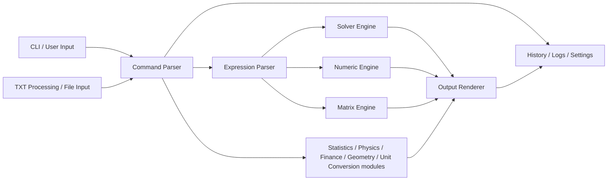
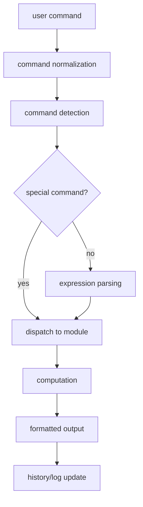

# Advanced Trigonometry Calculator Architecture

This document describes the high-level architecture of Advanced Trigonometry
Calculator (ATC). It avoids implementation claims that are not visible in the
repository.

## Overview

ATC is a Windows console application written in C++. It is organized around a
command-line input loop, command routing, expression processing, mathematical
modules, persisted settings, and regression tests.

## Module Architecture and Execution Flow

The following diagram gives a compact view of the main ATC modules. It is
intended as a mental map for new contributors rather than a complete call graph.



The normal execution path is command-driven. Some commands are handled before
the mathematical expression parser, while others are normalized and then routed
to the relevant numeric or domain module.



In practice, `main.cpp`, `main_aux_processor.cpp`, `main_processor.cpp`,
`processing_core.cpp`, and `commands.cpp` share responsibility for this flow.
Specialized modules then handle the mathematical or workflow-specific work.

## CLI Entry Point

The main application starts in `Advanced Trigonometry Calculator/main.cpp`.

Startup responsibilities include:

- initializing ATC paths and runtime state;
- reading persisted settings such as precision mode;
- choosing the typed runtime path for `double` or Boost `mp_float`;
- handling command-line arguments and interactive console flow.

Interactive line input is delegated to `auto_complete.cpp`, which handles
line editing, history navigation and Tab completion before the command string
is passed into the normal processing flow.

## Command Dispatcher

Command routing is spread across the main processor files and command modules:

- `main.cpp`
- `main_aux_processor.cpp`
- `main_processor.cpp`
- `commands.cpp`

These files coordinate whether input is treated as a direct expression, a
special ATC command, a variable assignment, a matrix operation, a file/TXT
workflow, or an interactive menu action.

Autocomplete is intentionally kept outside the mathematical processors. It
helps the user complete command/function names and previous expressions, but
does not decide calculation semantics.

## Processing Core

`processing_core.cpp` contains the central expression-processing functions,
including:

- `initialProcessor<T>()`
- `arithSolver<T>()`
- `functionProcessor<T>()`

This layer evaluates arithmetic expressions, calls mathematical functions,
handles parts of implicit multiplication and formatting, and routes values
through the selected precision type.

## Mathematical Modules

Mathematical behavior is split across focused files, including:

- `trigonometry.cpp`
- `hyperbolic.cpp`
- `logarithmic.cpp`
- `statistics.cpp`
- `statistics_calculations.cpp`
- `digital_signal_processing.cpp`
- `polynomial_arithmetic.cpp`
- `equation_solver.cpp`
- `equations_system_solver.cpp`
- `solver.cpp`
- `function_study.cpp`
- `graph.cpp`
- `arithmetic_matrix_solver.cpp`

Some modules are command-oriented, while others provide lower-level numerical
or formatting support.

## Persistence Files

ATC stores user settings and runtime data under the user's ATC data folder,
commonly:

```text
%USERPROFILE%\Pictures\Advanced Trigonometry Calculator
```

Persisted files include settings such as:

- `higherPrecision.txt`
- `mode.txt`
- `verboseResolution.txt`
- `actualTime.txt`
- `dimensions.txt`
- `window.txt`
- `variables.txt`
- `renamedVar.txt`
- `pathName.txt`

The exact set of files may vary depending on which commands have been used.

## Windows Console Behavior

ATC is a console application and contains Windows-specific behavior for console
display, colors, window settings, and Windows Terminal compatibility.

Current 2.1.7 behavior includes:

- Windows 11 detection through `RtlGetVersion`;
- default intro handling for Windows 11 console environments;
- Win32-to-ANSI color mapping for Windows Terminal scenarios;
- commands that can launch new ATC instances or tabs when `wt.exe` is
  available, with fallback behavior.

## Tests

Tests are PowerShell-based and live in `tests/`.

The main regression runner executes ATC commands against built executables and
checks output patterns. The suite covers a broad set of documented behavior but
intentionally avoids unsafe PC-control commands. Deeply interactive modules have
safe runtime smoke coverage, while exhaustive per-option validation remains
manual or future automated work.

## Build Files

The root solution is:

```text
Advanced Trigonometry Calculator.sln
```

The main Visual Studio project is:

```text
Advanced Trigonometry Calculator/Advanced Trigonometry Calculator.vcxproj
```

The project uses a Windows console subsystem and currently includes Release x64
and Release x86 configurations.
