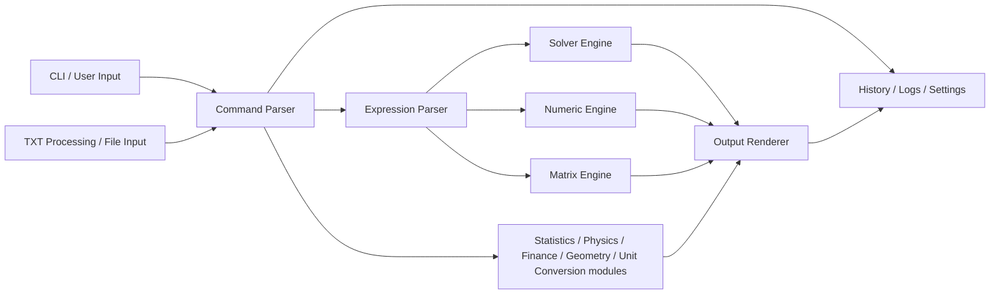
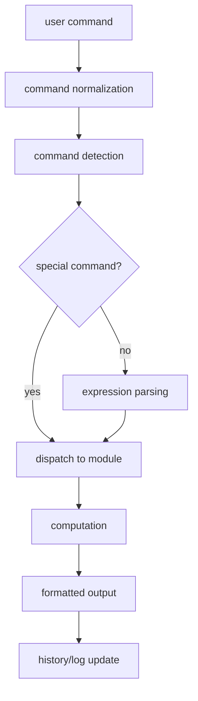

# Arquitetura do Advanced Trigonometry Calculator

Este documento descreve a arquitetura de alto nivel do Advanced Trigonometry
Calculator (ATC). O código-fonte continua a ser a autoridade para detalhes de
implementacao.

## Visao geral

O ATC é uma aplicação de consola Windows escrita em C++. A estrutura principal
envolve entrada por linha de comandos, parsing de comandos, processamento de
expressões, módulos matemáticos, ficheiros de settings e testes de regressão.

## Module Architecture and Execution Flow

Visao textual:

```text
User Input
  |
  v
Console Prompt / Command Editor
  |
  v
Tokenizer / Parser
  |
  v
Expression Engine
  |
  v
Feature Modules
  - Arithmetic
  - Trigonometry
  - Complex Numbers
  - Matrices
  - Statistics
  - DSP
  - Polynomial Tools
  - Equation Solver
  - Numerical Solver
  - Graph
  - TXT Processing
  - Guided Modules
  |
  v
Output / Results Store / Files
```





Na prática, `main.cpp`, `main_aux_processor.cpp`, `main_processor.cpp`,
`processing_core.cpp` e `commands.cpp` partilham a responsabilidade pelo fluxo
central. Os módulos especializados executam depois o trabalho matemático ou de
workflow.

## Fluxo de input até output

O input comeca normalmente no prompt da consola. O editor de comandos recolhe a
linha, suporta histórico/autocomplete e envia o texto para o fluxo normal de
processamento. A partir dai, o ATC decide se o input é uma expressão direta, um
comando nomeado ou um módulo guiado interativo.

Expressões diretas são avaliadas de imediato:

```text
2+2
sin(pi/2)
```

Comandos nomeados escolhem um workflow especifico:

```text
mode
solve equation(x^2-5*x+6)
```

Modulos guiados abrem menus ou prompts interativos:

```text
financial calculations
unit conversions
```

O resultado e formatado para consola, guardado na lista de resultados da sessao
quando aplicável e pode também ser escrito para ficheiros em comandos de
relatorio/exportacao.

## Resultados e variáveis

O ATC guarda resultados visiveis como entradas indexadas, por exemplo `#0`,
`#1` e seguintes. Estas referências permitem trabalhar passo a passo sem
reescrever expressões longas.

Variáveis nomeadas são tratadas pela camada de comandos/expressões e por
ficheiros persistentes quando a funcionalidade existente o exige. Variáveis
matriz e escalares partilham o workflow público, mas seguem caminhos internos
diferentes.

## Modelo de precisão

O ATC 2.1.7 pode executar o runtime tipado principal com `double` ou Boost
`mp_float`. O arranque lê a setting persistida e encaminha o runtime template.
Isto mantem o fluxo público de comandos praticamente igual, permitindo maior
precisão nos caminhos numéricos suportados.

## Multiplicacao automática

O motor de expressões suporta formas documentadas de multiplicacao implicita
entre constantes, fatores e funções. E uma conveniencia de utilização, não um
sistema simbólico geral. Alteracoes nesta area devem ser testadas com
aritmética, variáveis, funções, matrizes, polinómios, `solver(...)` e
`solve equation(...)`.

## TXT processing

Os workflows TXT encaminham input de ficheiro para o mesmo modelo de
processamento usado pelo input interativo. Os testes automáticos usam pastas
temporárias e mocks para efeitos colaterais de abertura de ficheiros/janelas.

## Limites arquiteturais

O ATC foca-se deliberadamente em cálculo numérico por comandos e em
funcionalidades hibridas simbólicas/numéricas implementadas. Não deve ser
tratado como CAS geral completo. Transformacoes simbólicas não suportadas devem
falhar de forma clara ou seguir fallbacks documentados.

## Onde integrar novos módulos

Novos módulos publicos devem normalmente integrar-se na camada de dispatch de
comandos e delegar o cálculo real para um ficheiro de módulo focado. Devem
também acrescentar:

- vocabulario de autocomplete quando util;
- cobertura de regressão ou smoke test;
- documentação no guia;
- notas de validação manual se o módulo for profundamente interativo.

## Entrada e dispatcher

O arranque esta em `Advanced Trigonometry Calculator/main.cpp`. A entrada
interativa usa `auto_complete.cpp` para edição de linha, histórico e
autocomplete antes de enviar o comando para o fluxo normal.

## Core de processamento

`processing_core.cpp` contém funções centrais como `initialProcessor<T>()`,
`arithSolver<T>()` e `functionProcessor<T>()`.

## Modulos matemáticos

Exemplos de módulos:

- `trigonometry.cpp`
- `hyperbolic.cpp`
- `logarithmic.cpp`
- `statistics.cpp`
- `digital_signal_processing.cpp`
- `polynomial_arithmetic.cpp`
- `equation_solver.cpp`
- `solver.cpp`
- `function_study.cpp`
- `graph.cpp`
- `arithmetic_matrix_solver.cpp`

## Persistencia

O ATC guarda settings e dados em:

```text
%USERPROFILE%\Pictures\Advanced Trigonometry Calculator
```

Exemplos: `higherPrecision.txt`, `mode.txt`, `variables.txt`,
`renamedVar.txt`, `history.txt`, `dimensions.txt` e `window.txt`.

## Testes

Os testes vivem em `tests/` e usam PowerShell. A suite principal e
`run-atc-regression.ps1`.
