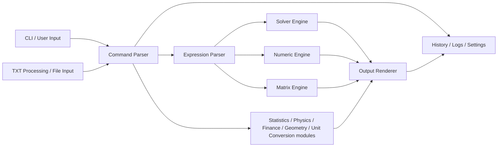
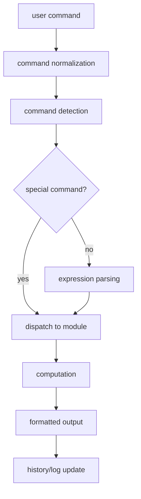

# Arquitetura do Advanced Trigonometry Calculator

Este documento descreve a arquitetura de alto nivel do Advanced Trigonometry
Calculator (ATC). O codigo-fonte continua a ser a autoridade para detalhes de
implementacao.

## Visao geral

O ATC e uma aplicacao de consola Windows escrita em C++. A estrutura principal
envolve entrada por linha de comandos, parsing de comandos, processamento de
expressoes, modulos matematicos, ficheiros de settings e testes de regressao.

## Module Architecture and Execution Flow





Na pratica, `main.cpp`, `main_aux_processor.cpp`, `main_processor.cpp`,
`processing_core.cpp` e `commands.cpp` partilham a responsabilidade pelo fluxo
central. Os modulos especializados executam depois o trabalho matematico ou de
workflow.

## Entrada e dispatcher

O arranque esta em `Advanced Trigonometry Calculator/main.cpp`. A entrada
interativa usa `auto_complete.cpp` para edicao de linha, historico e
autocomplete antes de enviar o comando para o fluxo normal.

## Core de processamento

`processing_core.cpp` contem funcoes centrais como `initialProcessor<T>()`,
`arithSolver<T>()` e `functionProcessor<T>()`.

## Modulos matematicos

Exemplos de modulos:

- `trigonometry.cpp`
- `hyperbolic.cpp`
- `logarithmic.cpp`
- `statistics.cpp`
- `digital_signal_processing.cpp`
- `polynomial_arithmetic.cpp`
- `equation_solver.cpp`
- `solver.cpp`
- `function_study.cpp`
- `graph.cpp`
- `arithmetic_matrix_solver.cpp`

## Persistencia

O ATC guarda settings e dados em:

```text
%USERPROFILE%\Pictures\Advanced Trigonometry Calculator
```

Exemplos: `higherPrecision.txt`, `mode.txt`, `variables.txt`,
`renamedVar.txt`, `history.txt`, `dimensions.txt` e `window.txt`.

## Testes

Os testes vivem em `tests/` e usam PowerShell. A suite principal e
`run-atc-regression.ps1`.
